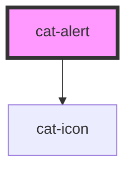

# cat-alert

<!-- Auto Generated Below -->

## Properties

| Property | Attribute | Description                                       | Type                                                             | Default     |
| -------- | --------- | ------------------------------------------------- | ---------------------------------------------------------------- | ----------- |
| `color`  | `color`   | The color palette of the alert.                   | `"danger" \| "primary" \| "secondary" \| "success" \| "warning"` | `'primary'` |
| `icon`   | `icon`    | The name of an icon to be displayed in the alert. | `string \| undefined`                                            | `undefined` |
| `noIcon` | `no-icon` | Whether the icon of the alert is deactivated.     | `boolean`                                                        | `false`     |

## Shadow Parts

| Part      | Description        |
| --------- | ------------------ |
| `"alert"` | The alert element. |

## Dependencies

### Depends on

- [cat-icon](../cat-icon)

### Graph

----------------------------------------------

Made with love in Hamburg, Germany
