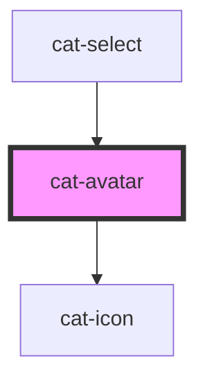

# cat-avatar

<!-- Auto Generated Below -->

## Overview

Avatars are used to represent a person or object.

## Properties

| Property           | Attribute  | Description                                                              | Type                                      | Default     |
| ------------------ | ---------- | ------------------------------------------------------------------------ | ----------------------------------------- | ----------- |
| `href`             | `href`     | A destination to link to, rendered in the href attribute of a link.      | `string \| undefined`                     | `undefined` |
| `icon`             | `icon`     | An icon to be used instead of the initials.                              | `string \| undefined`                     | `undefined` |
| `initials`         | `initials` | Custom initials for the avatar.                                          | `string \| undefined`                     | `undefined` |
| `label`            | `label`    | The label of the avatar.                                                 | `string \| undefined`                     | `undefined` |
| `nativeAttributes` | --         | Attributes that will be added to the native HTML anchor or span element. | `undefined \| { [key: string]: string; }` | `undefined` |
| `round`            | `round`    | Use round avatar edges.                                                  | `boolean`                                 | `false`     |
| `size`             | `size`     | The size of the avatar.                                                  | `"l" \| "m" \| "s" \| "xl" \| "xs"`       | `'m'`       |
| `src`              | `src`      | An optional avatar image.                                                | `string \| undefined`                     | `undefined` |
| `target`           | `target`   | Specifies where to open the linked document.                             | `string \| undefined`                     | `undefined` |

## CSS Custom Properties

| Name                     | Description                         |
| ------------------------ | ----------------------------------- |
| `--cat-avatar-bg`        | The background color of the avatar. |
| `--cat-avatar-fill`      | The text color of the avatar.       |
| `--cat-avatar-font-size` | The font size of the avatar.        |
| `--cat-avatar-size`      | The size of the avatar.             |

## Dependencies

### Used by

 - [cat-select](../cat-select)

### Depends on

- [cat-icon](../cat-icon)

### Graph

----------------------------------------------

Made with love in Hamburg, Germany
