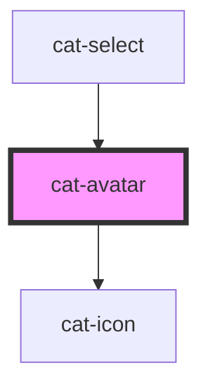

# cat-avatar

<!-- Auto Generated Below -->

## Overview

Avatars are used to represent a person or object.

## Properties

| Property    | Attribute    | Description                                                         | Type                                | Default     |
| ----------- | ------------ | ------------------------------------------------------------------- | ----------------------------------- | ----------- |
| `icon`      | `icon`       | An icon to be used instead of the initials.                         | `string \| undefined`               | `undefined` |
| `initials`  | `initials`   | Custom initials for the avatar.                                     | `string \| undefined`               | `undefined` |
| `label`     | `label`      | The label of the avatar.                                            | `string`                            | `''`        |
| `round`     | `round`      | Use round avatar edges.                                             | `boolean`                           | `false`     |
| `size`      | `size`       | The size of the avatar.                                             | `"l" \| "m" \| "s" \| "xl" \| "xs"` | `'m'`       |
| `src`       | `src`        | An optional avatar image.                                           | `string \| undefined`               | `undefined` |
| `url`       | `url`        | A destination to link to, rendered in the href attribute of a link. | `string \| undefined`               | `undefined` |
| `urlTarget` | `url-target` | Specifies where to open the linked document.                        | `"_blank" \| "_self" \| undefined`  | `undefined` |

## CSS Custom Properties

| Name                     | Description                         |
| ------------------------ | ----------------------------------- |
| `--cat-avatar-bg`        | The background color of the avatar. |
| `--cat-avatar-fill`      | The text color of the avatar.       |
| `--cat-avatar-font-size` | The font size of the avatar.        |
| `--cat-avatar-size`      | The size of the avatar.             |

## Dependencies

### Used by

 - [cat-select](../cat-select)

### Depends on

- [cat-icon](../cat-icon)

### Graph

----------------------------------------------

Made with love in Hamburg, Germany
