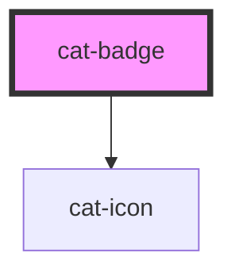

# cat-badge

<!-- Auto Generated Below -->

## Overview

Badges are used to inform users of the status of an object or of an action
that’s been taken.

## Properties

| Property    | Attribute    | Description                                               | Type                                                                       | Default     |
| ----------- | ------------ | --------------------------------------------------------- | -------------------------------------------------------------------------- | ----------- |
| `color`     | `color`      | The color palette of the badge.                           | `"danger" \| "info" \| "primary" \| "secondary" \| "success" \| "warning"` | `'primary'` |
| `icon`      | `icon`       | The name of an icon to be displayed in the button.        | `string \| undefined`                                                      | `undefined` |
| `iconOnly`  | `icon-only`  | Hide the actual button content and only display the icon. | `"l" \| "m" \| "s" \| "xl" \| "xs" \| boolean`                             | `false`     |
| `iconRight` | `icon-right` | Display the icon on the right.                            | `boolean`                                                                  | `false`     |
| `pulse`     | `pulse`      | Draw attention to the badge with a subtle animation.      | `boolean`                                                                  | `false`     |
| `round`     | `round`      | Use round badge edges.                                    | `boolean`                                                                  | `false`     |
| `size`      | `size`       | The size of the badge.                                    | `"l" \| "m" \| "s" \| "xl" \| "xs"`                                        | `'m'`       |
| `variant`   | `variant`    | The rendering style of the badge.                         | `"filled" \| "outlined"`                                                   | `'filled'`  |

## Shadow Parts

| Part       | Description |
| ---------- | ----------- |
| `"prefix"` |             |

## Dependencies

### Depends on

- [cat-icon](../cat-icon)

### Graph

----------------------------------------------

Made with love in Hamburg, Germany
