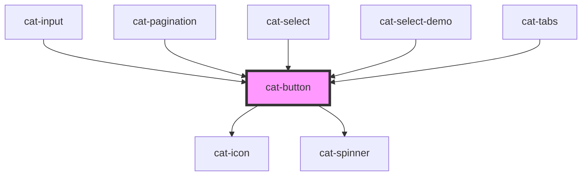

 # cat-button

<!-- Auto Generated Below -->

## Overview

Buttons are used for interface actions. Primary style should be used only
once per view for main call-to-action.

## Properties

| Property              | Attribute               | Description                                                                                                                                                                                                        | Type                                                             | Default       |
| --------------------- | ----------------------- | ------------------------------------------------------------------------------------------------------------------------------------------------------------------------------------------------------------------ | ---------------------------------------------------------------- | ------------- |
| `a11yCurrent`         | `a11y-current`          | Sets the `aria-current` attribute on the button.                                                                                                                                                                   | `string \| undefined`                                            | `undefined`   |
| `a11yLabel`           | `a11y-label`            | Adds accessible label for the button that is only shown for screen readers. Typically, this label text replaces the visible text on the button for users who use assistive technology.                             | `string \| undefined`                                            | `undefined`   |
| `active`              | `active`                | Set the button into an active state.                                                                                                                                                                               | `boolean`                                                        | `false`       |
| `buttonGroupPosition` | `button-group-position` | The index of a button that is used inside a cat-button-group component                                                                                                                                             | `"first" \| "last" \| "middle" \| undefined`                     | `undefined`   |
| `buttonId`            | `button-id`             | Adds a unique identifier for the button. Please note that with this particular component this ID is added inside the web component. If you need an ID on the HTML element, use the regular `id` attribute instead. | `string \| undefined`                                            | `undefined`   |
| `color`               | `color`                 | The color palette of the button.                                                                                                                                                                                   | `"danger" \| "primary" \| "secondary" \| "success" \| "warning"` | `'secondary'` |
| `disabled`            | `disabled`              | Specifies that the button should be disabled. A disabled button is unusable and un-clickable. Corresponds with the native HTML disabled attribute.                                                                 | `boolean`                                                        | `false`       |
| `icon`                | `icon`                  | The name of an icon to be displayed in the button.                                                                                                                                                                 | `string \| undefined`                                            | `undefined`   |
| `iconOnly`            | `icon-only`             | Hide the actual button content and only display the icon.                                                                                                                                                          | `"l" \| "m" \| "s" \| "xl" \| "xs" \| boolean`                   | `false`       |
| `iconRight`           | `icon-right`            | Display the icon on the right.                                                                                                                                                                                     | `boolean`                                                        | `false`       |
| `loading`             | `loading`               | Displays the button in a loading state with a spinner. Just like a disabled button, an inactive button is unusable and un-clickable. However, it retains the current focus state.                                  | `boolean`                                                        | `false`       |
| `name`                | `name`                  | The name of the button, which gets paired with the button's value when submitted as part of a form. Corresponds with the native HTML name attribute.                                                               | `string \| undefined`                                            | `undefined`   |
| `nativeAttributes`    | --                      | Attributes that will be added to the native HTML button element                                                                                                                                                    | `undefined \| { [key: string]: string; }`                        | `undefined`   |
| `noEllipsis`          | `no-ellipsis`           | Disables ellipse overflowing button content.                                                                                                                                                                       | `boolean`                                                        | `false`       |
| `round`               | `round`                 | Use round button edges.                                                                                                                                                                                            | `boolean`                                                        | `false`       |
| `size`                | `size`                  | The size of the button.                                                                                                                                                                                            | `"l" \| "m" \| "s" \| "xl" \| "xs"`                              | `'m'`         |
| `submit`              | `submit`                | Allows the button to submit a form.                                                                                                                                                                                | `boolean`                                                        | `false`       |
| `url`                 | `url`                   | A destination to link to, rendered in the href attribute of a link.                                                                                                                                                | `string \| undefined`                                            | `undefined`   |
| `urlTarget`           | `url-target`            | Specifies where to open the linked document.                                                                                                                                                                       | `"_blank" \| "_self" \| undefined`                               | `undefined`   |
| `value`               | `value`                 | The value of the button, which gets paired with the button's name when submitted as part of a form. Corresponds with the native HTML value attribute.                                                              | `string \| undefined`                                            | `undefined`   |
| `variant`             | `variant`               | The rendering style of the button.                                                                                                                                                                                 | `"filled" \| "outlined" \| "text"`                               | `'outlined'`  |

## Events

| Event      | Description                             | Type                      |
| ---------- | --------------------------------------- | ------------------------- |
| `catBlur`  | Emitted when the button loses focus.    | `CustomEvent<FocusEvent>` |
| `catClick` | Emitted when the button is clicked.     | `CustomEvent<MouseEvent>` |
| `catFocus` | Emitted when the button received focus. | `CustomEvent<FocusEvent>` |

## Methods

### `doBlur() => Promise<void>`

Programmatically remove focus from the button. Use this method instead of
`button.blur()`.

#### Returns

Type: `Promise<void>`

### `doClick() => Promise<void>`

Programmatically simulate a click on the button.

#### Returns

Type: `Promise<void>`

### `doFocus(options?: FocusOptions) => Promise<void>`

Programmatically move focus to the button. Use this method instead of
`button.focus()`.

#### Returns

Type: `Promise<void>`

## Shadow Parts

| Part        | Description                          |
| ----------- | ------------------------------------ |
| `"button"`  | The native anchor or button element. |
| `"content"` | The textual content of the button.   |
| `"prefix"`  | The prefix icon.                     |
| `"suffix"`  | The suffix icon.                     |

## Dependencies

### Used by

 - [cat-input](../cat-input)
 - [cat-pagination](../cat-pagination)
 - [cat-select](../cat-select)
 - [cat-select-demo](../cat-select-demo)
 - [cat-tabs](../cat-tabs)

### Depends on

- [cat-icon](../cat-icon)
- [cat-spinner](../cat-spinner)

### Graph

----------------------------------------------

Made with love in Hamburg, Germany
