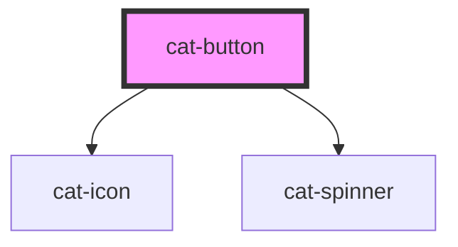

# cat-button

<!-- Auto Generated Below -->

## Properties

| Property          | Attribute             | Description                                                                                                                                                                                                        | Type                                | Default       |
| ----------------- | --------------------- | ------------------------------------------------------------------------------------------------------------------------------------------------------------------------------------------------------------------ | ----------------------------------- | ------------- |
| `a11yControls`    | `a-1-1y-controls`     | Use this property to add an `aria-controls` attribute to the button. Use the attribute to point to the unique ID of the content that the button manages.                                                           | `string \| undefined`               | `undefined`   |
| `a11yDescribedBy` | `a-1-1y-described-by` | Indicates the ID of a component that describes the button.                                                                                                                                                         | `string \| undefined`               | `undefined`   |
| `a11yLabel`       | `a-1-1y-label`        | Adds accessible label for the button that is only shown for screen readers. Typically, this label text replaces the visible text on the button for users who use assistive technology.                             | `string \| undefined`               | `undefined`   |
| `a11yOwns`        | `a-1-1y-owns`         | Indicates the ID of a component owned by the button.                                                                                                                                                               | `string \| undefined`               | `undefined`   |
| `buttonClass`     | `button-class`        | Adds a class for the button. Please note that with this particular component this ID is added inside the web component. If you need a class on the HTML element, use the regular `class` attribute instead.        | `string \| undefined`               | `undefined`   |
| `buttonId`        | `button-id`           | Adds a unique identifier for the button. Please note that with this particular component this ID is added inside the web component. If you need an ID on the HTML element, use the regular `id` attribute instead. | `string \| undefined`               | `undefined`   |
| `contentClass`    | `content-class`       | A custom class to be added to the button's textual content.                                                                                                                                                        | `string \| undefined`               | `undefined`   |
| `disabled`        | `disabled`            | Specifies that the button should be disabled. A disabled button is unusable and un-clickable. Corresponds with the native HTML disabled attribute.                                                                 | `boolean`                           | `false`       |
| `ellipsed`        | `ellipsed`            | Ellipse overflowing button content.                                                                                                                                                                                | `boolean`                           | `true`        |
| `iconClass`       | `icon-class`          | A custom class to be added to the button's prefix and suffix icons.                                                                                                                                                | `string \| undefined`               | `undefined`   |
| `inactive`        | `inactive`            | Specifies that the button should be inactive. Just like a disabled button, an inactive button is unusable and un-clickable. However, it retains the current focus state.                                           | `boolean`                           | `false`       |
| `loading`         | `loading`             | Displays the button in a loading state with a spinner. Just like a disabled button, an inactive button is unusable and un-clickable. However, it retains the current focus state.                                  | `boolean`                           | `false`       |
| `name`            | `name`                | The name of the button, which gets paired with the button's value when submitted as part of a form. Corresponds with the native HTML name attribute.                                                               | `string \| undefined`               | `undefined`   |
| `prefixIcon`      | `prefix-icon`         | The name of an icon to be displayed before the button content.                                                                                                                                                     | `string \| undefined`               | `undefined`   |
| `round`           | `round`               | Use round button edges.                                                                                                                                                                                            | `boolean`                           | `false`       |
| `size`            | `size`                | The size of the button.                                                                                                                                                                                            | `"l" \| "m" \| "s" \| "xl" \| "xs"` | `'m'`         |
| `submit`          | `submit`              | Allows the button to submit a form.                                                                                                                                                                                | `boolean`                           | `false`       |
| `suffixIcon`      | `suffix-icon`         | The name of an icon to be displayed after the button content.                                                                                                                                                      | `string \| undefined`               | `undefined`   |
| `theme`           | `theme`               | The theme color palette of the button.                                                                                                                                                                             | `"primary" \| "secondary"`          | `'secondary'` |
| `url`             | `url`                 | A destination to link to, rendered in the href attribute of a link.                                                                                                                                                | `string \| undefined`               | `undefined`   |
| `urlTarget`       | `url-target`          | Specifies where to open the linked document.                                                                                                                                                                       | `"_blank" \| "_self" \| undefined`  | `undefined`   |
| `value`           | `value`               | The value of the button, which gets paired with the button's name when submitted as part of a form. Corresponds with the native HTML value attribute.                                                              | `string \| undefined`               | `undefined`   |

## Events

| Event      | Description                             | Type                      |
| ---------- | --------------------------------------- | ------------------------- |
| `catBlur`  | Emitted when the button loses focus.    | `CustomEvent<FocusEvent>` |
| `catFocus` | Emitted when the button received focus. | `CustomEvent<FocusEvent>` |

## Methods

### `setFocus(options?: FocusOptions | undefined) => Promise<void>`

Sets focus on the button. Use this method instead of `button.focus()`.

#### Returns

Type: `Promise<void>`

## Dependencies

### Depends on

- [cat-icon](../cat-icon)
- [cat-spinner](../cat-spinner)

### Graph

---

_Built with [StencilJS](https://stenciljs.com/)_
