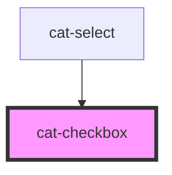

# cat-checkbox

<!-- Auto Generated Below -->

## Overview

Checkboxes are used to let a user choose one or more options from a limited
number of options.

## Properties

| Property           | Attribute         | Description                                                                                                                                                                                                         | Type                                                                                       | Default     |
| ------------------ | ----------------- | ------------------------------------------------------------------------------------------------------------------------------------------------------------------------------------------------------------------- | ------------------------------------------------------------------------------------------ | ----------- |
| `alignment`        | `alignment`       | The alignment of the checkbox.                                                                                                                                                                                      | `"bottom" \| "center" \| "top"`                                                            | `'top'`     |
| `checked`          | `checked`         | Checked state of the checkbox                                                                                                                                                                                       | `boolean`                                                                                  | `false`     |
| `disabled`         | `disabled`        | Disabled state of the checkbox                                                                                                                                                                                      | `boolean`                                                                                  | `false`     |
| `hint`             | `hint`            | Optional hint text(s) to be displayed with the checkbox.                                                                                                                                                            | `string \| string[] \| undefined`                                                          | `undefined` |
| `identifier`       | `identifier`      | A unique identifier for the input.                                                                                                                                                                                  | `string \| undefined`                                                                      | `undefined` |
| `indeterminate`    | `indeterminate`   | Indeterminate state of the checkbox                                                                                                                                                                                 | `boolean`                                                                                  | `false`     |
| `label`            | `label`           | Label of the checkbox which is presented in the UI                                                                                                                                                                  | `string`                                                                                   | `''`        |
| `labelHidden`      | `label-hidden`    | Visually hide the label, but still show it to assistive technologies like screen readers.                                                                                                                           | `boolean`                                                                                  | `false`     |
| `labelLeft`        | `label-left`      | Whether the label should appear to the left of the checkbox.                                                                                                                                                        | `boolean`                                                                                  | `false`     |
| `name`             | `name`            | The name of the input.                                                                                                                                                                                              | `string \| undefined`                                                                      | `undefined` |
| `nativeAttributes` | --                | Attributes that will be added to the native HTML input element.                                                                                                                                                     | `undefined \| { [key: string]: string; }`                                                  | `undefined` |
| `noValue`          | `no-value`        | The value of the unchecked checkbox.                                                                                                                                                                                | `any`                                                                                      | `undefined` |
| `required`         | `required`        | Required state of the checkbox.                                                                                                                                                                                     | `boolean`                                                                                  | `false`     |
| `requiredMarker`   | `required-marker` | Whether the label need a marker to shown if the input is required or optional.                                                                                                                                      | `"none!" \| "none" \| "optional!" \| "optional" \| "required!" \| "required" \| undefined` | `'none'`    |
| `resolvedValue`    | `resolved-value`  | The resolved value of the checkbox, based on the checked state and value.                                                                                                                                           | `any`                                                                                      | `null`      |
| `testId`           | `test-id`         | A unique identifier for the underlying native element that is used for testing purposes. The attribute is added as `data-test` attribute and acts as a shorthand for `nativeAttributes={ 'data-test': 'test-Id' }`. | `string \| undefined`                                                                      | `undefined` |
| `value`            | `value`           | The value of the checked checkbox.                                                                                                                                                                                  | `any`                                                                                      | `undefined` |

## Events

| Event       | Description                                                 | Type                      |
| ----------- | ----------------------------------------------------------- | ------------------------- |
| `catBlur`   | Emitted when the checkbox loses focus.                      | `CustomEvent<FocusEvent>` |
| `catChange` | Emitted when the checked status of the checkbox is changed. | `CustomEvent<any>`        |
| `catFocus`  | Emitted when the checkbox received focus.                   | `CustomEvent<FocusEvent>` |

## Methods

### `doBlur() => Promise<void>`

Programmatically remove focus from the checkbox. Use this method instead of
`input.blur()`.

#### Returns

Type: `Promise<void>`

### `doFocus(options?: FocusOptions) => Promise<void>`

Programmatically move focus to the checkbox. Use this method instead of
`input.focus()`.

#### Parameters

| Name      | Type                        | Description                                                                      |
| --------- | --------------------------- | -------------------------------------------------------------------------------- |
| `options` | `FocusOptions \| undefined` | An optional object providing options to control aspects of the focusing process. |

#### Returns

Type: `Promise<void>`

## Slots

| Slot      | Description                                                                                                          |
| --------- | -------------------------------------------------------------------------------------------------------------------- |
| `"hint"`  | Optional hint element to be displayed with the checkbox.                                                             |
| `"label"` | The slotted label. If both the label property and the label slot are present, only the label slot will be displayed. |

## Shadow Parts

| Part      | Description               |
| --------- | ------------------------- |
| `"input"` | The native input element. |
| `"label"` | The label content.        |

## Dependencies

### Used by

 - [cat-select](../cat-select)

### Graph

----------------------------------------------

Made with love in Hamburg, Germany
