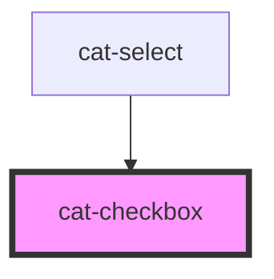

# cat-checkbox

<!-- Auto Generated Below -->

## Properties

| Property        | Attribute       | Description                                                                               | Type                              | Default     |
| --------------- | --------------- | ----------------------------------------------------------------------------------------- | --------------------------------- | ----------- |
| `checked`       | `checked`       | Checked state of the checkbox                                                             | `boolean`                         | `false`     |
| `disabled`      | `disabled`      | Disabled state of the checkbox                                                            | `boolean`                         | `false`     |
| `hint`          | `hint`          | Optional hint text(s) to be displayed with the checkbox.                                  | `string \| string[] \| undefined` | `undefined` |
| `indeterminate` | `indeterminate` | Indeterminate state of the checkbox                                                       | `boolean`                         | `false`     |
| `label`         | `label`         | Label of the checkbox which is presented in the UI                                        | `string`                          | `''`        |
| `labelHidden`   | `label-hidden`  | Visually hide the label, but still show it to assistive technologies like screen readers. | `boolean`                         | `false`     |
| `labelLeft`     | `label-left`    | Whether the label should appear to the left of the checkbox.                              | `boolean`                         | `false`     |
| `name`          | `name`          | The name of the input                                                                     | `string \| undefined`             | `undefined` |
| `required`      | `required`      | Required state of the checkbox                                                            | `boolean`                         | `false`     |
| `value`         | `value`         | The value of the checkbox                                                                 | `boolean \| string \| undefined`  | `undefined` |

## Events

| Event       | Description                                                 | Type                      |
| ----------- | ----------------------------------------------------------- | ------------------------- |
| `catBlur`   | Emitted when the checkbox loses focus.                      | `CustomEvent<FocusEvent>` |
| `catChange` | Emitted when the checked status of the checkbox is changed. | `CustomEvent<any>`        |
| `catFocus`  | Emitted when the checkbox received focus.                   | `CustomEvent<FocusEvent>` |

## Methods

### `doBlur() => Promise<void>`

Programmatically remove focus from the checkbox. Use this method instead of
`input.blur()`.

#### Returns

Type: `Promise<void>`

### `doClick() => Promise<void>`

Programmatically simulate a click on the checkbox.

#### Returns

Type: `Promise<void>`

### `doFocus(options?: FocusOptions | undefined) => Promise<void>`

Programmatically move focus to the checkbox. Use this method instead of
`input.focus()`.

#### Returns

Type: `Promise<void>`

## Slots

| Slot      | Description                                                                                                          |
| --------- | -------------------------------------------------------------------------------------------------------------------- |
| `"hint"`  | Optional hint element to be displayed with the checkbox.                                                             |
| `"label"` | The slotted label. If both the label property and the label slot are present, only the label slot will be displayed. |

## Shadow Parts

| Part         | Description           |
| ------------ | --------------------- |
| `"checkbox"` | The checkbox element. |
| `"label"`    | The label content.    |

## Dependencies

### Used by

 - [cat-select](../cat-select)

### Graph

----------------------------------------------

Made with love in Hamburg, Germany
