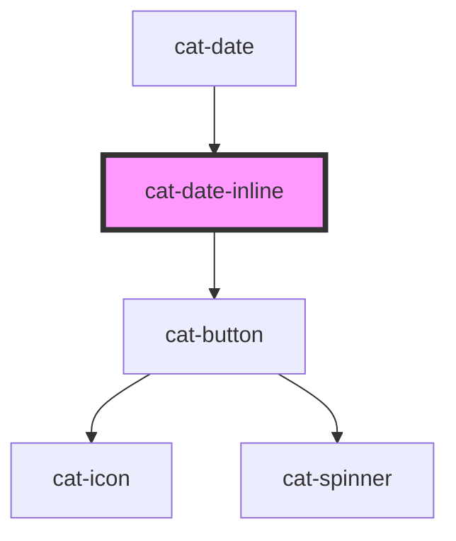

# cat-date-inline

<!-- Auto Generated Below -->

## Overview

An inline date picker component to select a date.

## Properties

| Property         | Attribute         | Description                                                                                                            | Type                                                                                       | Default      |
| ---------------- | ----------------- | ---------------------------------------------------------------------------------------------------------------------- | ------------------------------------------------------------------------------------------ | ------------ |
| `a11yLabel`      | `a11y-label`      | Adds accessible label for the datepicker. The label will be read by assistive technology upon focusing the datepicker. | `string \| undefined`                                                                      | `undefined`  |
| `hint`           | `hint`            | Shows an arrow keys navigation hint.                                                                                   | `boolean`                                                                                  | `false`      |
| `identifier`     | `identifier`      | A unique identifier for the input.                                                                                     | `string \| undefined`                                                                      | `undefined`  |
| `label`          | `label`           | The label for the input.                                                                                               | `string`                                                                                   | `''`         |
| `labelHidden`    | `label-hidden`    | Visually hide the label, but still show it to assistive technologies like screen readers.                              | `boolean`                                                                                  | `false`      |
| `max`            | `max`             | A maximum value for the date, given in local ISO 8601 date format YYYY-MM-DD.                                          | `string \| undefined`                                                                      | `undefined`  |
| `min`            | `min`             | A minimum value for the date, given in local ISO 8601 date format YYYY-MM-DD.                                          | `string \| undefined`                                                                      | `undefined`  |
| `noClear`        | `no-clear`        | Hides the clear button.                                                                                                | `boolean`                                                                                  | `false`      |
| `noToday`        | `no-today`        | Hides the today button.                                                                                                | `boolean`                                                                                  | `false`      |
| `range`          | `range`           | Allow the selection of a range of dates, i.e. start and end date.                                                      | `boolean`                                                                                  | `false`      |
| `required`       | `required`        | A value is required or must be check for the form to be submittable.                                                   | `boolean`                                                                                  | `false`      |
| `requiredMarker` | `required-marker` | Whether the label need a marker to shown if the input is required or optional.                                         | `"none!" \| "none" \| "optional!" \| "optional" \| "required!" \| "required" \| undefined` | `'optional'` |
| `value`          | `value`           | The value of the control, given in local ISO 8601 date format YYYY-MM-DD.                                              | `string \| undefined`                                                                      | `undefined`  |
| `weeks`          | `weeks`           | Show week numbers.                                                                                                     | `boolean`                                                                                  | `false`      |

## Events

| Event       | Description                        | Type                  |
| ----------- | ---------------------------------- | --------------------- |
| `catChange` | Emitted when the value is changed. | `CustomEvent<string>` |

## Methods

### `clear() => Promise<void>`

Clear the picker.

#### Returns

Type: `Promise<void>`

### `doFocus(options?: FocusOptions) => Promise<void>`

Programmatically move focus to the inline datepicker, i,e, the first
focusable date.

#### Parameters

| Name      | Type                        | Description                                                                      |
| --------- | --------------------------- | -------------------------------------------------------------------------------- |
| `options` | `FocusOptions \| undefined` | An optional object providing options to control aspects of the focusing process. |

#### Returns

Type: `Promise<void>`

### `resetView() => Promise<void>`

Resets the view of the picker.

#### Returns

Type: `Promise<void>`

### `select(date: Date | null) => Promise<void>`

Select a date in the picker.

#### Parameters

| Name   | Type           | Description         |
| ------ | -------------- | ------------------- |
| `date` | `Date \| null` | The date to select. |

#### Returns

Type: `Promise<void>`

## Shadow Parts

| Part      | Description |
| --------- | ----------- |
| `"label"` |             |

## Dependencies

### Used by

 - [cat-date](../cat-date)

### Depends on

- [cat-button](../cat-button)

### Graph

----------------------------------------------

Made with love in Hamburg, Germany
