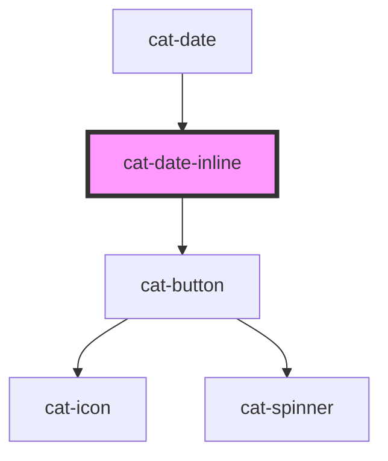

# cat-date-inline

<!-- Auto Generated Below -->

## Overview

An inline date picker component to select a date.

## Properties

| Property  | Attribute  | Description                                                                   | Type                  | Default     |
| --------- | ---------- | ----------------------------------------------------------------------------- | --------------------- | ----------- |
| `max`     | `max`      | A maximum value for the date, given in local ISO 8601 date format YYYY-MM-DD. | `string \| undefined` | `undefined` |
| `min`     | `min`      | A minimum value for the date, given in local ISO 8601 date format YYYY-MM-DD. | `string \| undefined` | `undefined` |
| `noClear` | `no-clear` | Hides the clear button.                                                       | `boolean`             | `false`     |
| `noHint`  | `no-hint`  | Hides the arrow navigation hint.                                              | `boolean`             | `false`     |
| `noToday` | `no-today` | Hides the today button.                                                       | `boolean`             | `false`     |
| `noWeeks` | `no-weeks` | Hides the week numbers.                                                       | `boolean`             | `false`     |
| `range`   | `range`    | Allow the selection of a range of dates, i.e. start and end date.             | `boolean`             | `false`     |
| `size`    | `size`     | The size of the date picker.                                                  | `"m" \| "s"`          | `'m'`       |
| `value`   | `value`    | The value of the control, given in local ISO 8601 date format YYYY-MM-DD.     | `string \| undefined` | `undefined` |

## Events

| Event       | Description                        | Type                  |
| ----------- | ---------------------------------- | --------------------- |
| `catChange` | Emitted when the value is changed. | `CustomEvent<string>` |

## Methods

### `clear() => Promise<void>`

Clear the picker.

#### Returns

Type: `Promise<void>`

### `resetView() => Promise<void>`

Resets the view of the picker.

#### Returns

Type: `Promise<void>`

### `select(date: Date | null) => Promise<void>`

Select a date in the picker.

#### Parameters

| Name   | Type           | Description         |
| ------ | -------------- | ------------------- |
| `date` | `Date \| null` | The date to select. |

#### Returns

Type: `Promise<void>`

## Dependencies

### Used by

 - [cat-date](../cat-date)

### Depends on

- [cat-button](../cat-button)

### Graph

----------------------------------------------

Made with love in Hamburg, Germany
