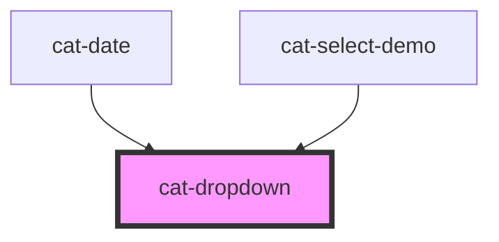

# cat-dropdown

<!-- Auto Generated Below -->

## Properties

| Property        | Attribute        | Description                                                        | Type                                                                                                                                                                 | Default          |
| --------------- | ---------------- | ------------------------------------------------------------------ | -------------------------------------------------------------------------------------------------------------------------------------------------------------------- | ---------------- |
| `noAutoClose`   | `no-auto-close`  | Do not close the dropdown on outside clicks.                       | `boolean`                                                                                                                                                            | `false`          |
| `noKeybindings` | `no-keybindings` | Do not navigate focus inside the dropdown via vertical arrow keys. | `boolean`                                                                                                                                                            | `false`          |
| `overflow`      | `overflow`       | Allow overflow when dropdown is open.                              | `boolean`                                                                                                                                                            | `false`          |
| `placement`     | `placement`      | The placement of the dropdown.                                     | `"bottom" \| "bottom-end" \| "bottom-start" \| "left" \| "left-end" \| "left-start" \| "right" \| "right-end" \| "right-start" \| "top" \| "top-end" \| "top-start"` | `'bottom-start'` |

## Events

| Event      | Description                          | Type                      |
| ---------- | ------------------------------------ | ------------------------- |
| `catClose` | Emitted when the dropdown is closed. | `CustomEvent<FocusEvent>` |
| `catOpen`  | Emitted when the dropdown is opened. | `CustomEvent<FocusEvent>` |

## Methods

### `close() => Promise<void>`

Closes the dropdown.

#### Returns

Type: `Promise<void>`

### `open() => Promise<void>`

Opens the dropdown.

#### Returns

Type: `Promise<void>`

### `toggle() => Promise<void>`

Toggles the dropdown.

#### Returns

Type: `Promise<void>`

## Dependencies

### Used by

 - [cat-date](../cat-date)
 - [cat-select-demo](../cat-select-demo)

### Graph

----------------------------------------------

Made with love in Hamburg, Germany
