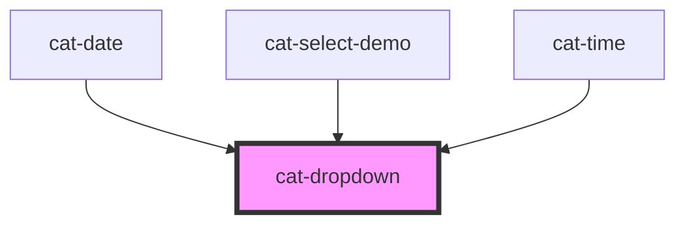

# cat-dropdown

<!-- Auto Generated Below -->

## Overview

A dropdown component to display a list of actions in a dropdown menu or to
show additional content on demand.

## Properties

| Property          | Attribute          | Description                                                                                                                                                                                 | Type                                                                                                                                                                 | Default          |
| ----------------- | ------------------ | ------------------------------------------------------------------------------------------------------------------------------------------------------------------------------------------- | -------------------------------------------------------------------------------------------------------------------------------------------------------------------- | ---------------- |
| `arrowNavigation` | `arrow-navigation` | Do not navigate focus inside the dropdown via vertical arrow keys.                                                                                                                          | `"horizontal" \| "none" \| "vertical"`                                                                                                                               | `'vertical'`     |
| `noAutoClose`     | `no-auto-close`    | Do not close the dropdown on outside clicks.                                                                                                                                                | `boolean`                                                                                                                                                            | `false`          |
| `noInitialFocus`  | `no-initial-focus` | **[DEPRECATED]**   No element in dropdown will receive focus when dropdown is open. By default, the first element in tab order will receive a focus. | `boolean`                                                                                                                                                            | `false`          |
| `noResize`        | `no-resize`        | Do not change the size of the dropdown to ensure it isn’t too big to fit in the viewport (or more specifically, its clipping context).                                                      | `boolean`                                                                                                                                                            | `false`          |
| `noReturnFocus`   | `no-return-focus`  | Trigger element will not receive focus when dropdown is closed.                                                                                                                             | `boolean`                                                                                                                                                            | `false`          |
| `overflow`        | `overflow`         | Allow overflow when dropdown is open.                                                                                                                                                       | `boolean`                                                                                                                                                            | `false`          |
| `placement`       | `placement`        | The placement of the dropdown.                                                                                                                                                              | `"bottom" \| "bottom-end" \| "bottom-start" \| "left" \| "left-end" \| "left-start" \| "right" \| "right-end" \| "right-start" \| "top" \| "top-end" \| "top-start"` | `'bottom-start'` |

## Events

| Event      | Description                          | Type                      |
| ---------- | ------------------------------------ | ------------------------- |
| `catClose` | Emitted when the dropdown is closed. | `CustomEvent<FocusEvent>` |
| `catOpen`  | Emitted when the dropdown is opened. | `CustomEvent<FocusEvent>` |

## Methods

### `close() => Promise<void>`

Closes the dropdown.

#### Returns

Type: `Promise<void>`

### `open(isFocusVisible?: boolean) => Promise<void>`

Opens the dropdown.

#### Parameters

| Name             | Type                   | Description                                                |
| ---------------- | ---------------------- | ---------------------------------------------------------- |
| `isFocusVisible` | `boolean \| undefined` | is dropdown should receive visible focus when it's opened. |

#### Returns

Type: `Promise<void>`

### `toggle() => Promise<void>`

Toggles the dropdown.

#### Returns

Type: `Promise<void>`

## Dependencies

### Used by

 - [cat-date](../cat-date)
 - [cat-select-demo](../cat-select-demo)
 - [cat-time](../cat-time)

### Graph

----------------------------------------------

Made with love in Hamburg, Germany
