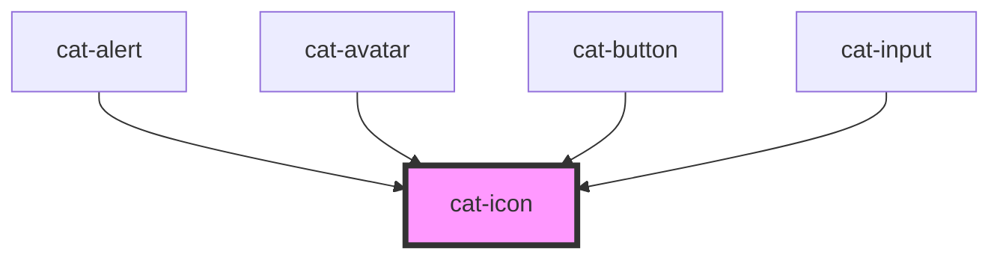

# cat-icon

<!-- Auto Generated Below -->

## Properties

| Property    | Attribute    | Description                                                                                                                               | Type                                            | Default     |
| ----------- | ------------ | ----------------------------------------------------------------------------------------------------------------------------------------- | ----------------------------------------------- | ----------- |
| `a11yLabel` | `a11y-label` | Adds accessible label for the icon that is only shown for screen readers. The `aria-hidden` attribute will be set if no label is present. | `string \| undefined`                           | `undefined` |
| `icon`      | `icon`       | The name of the icon.                                                                                                                     | `string \| undefined`                           | `undefined` |
| `iconSrc`   | `icon-src`   | The SVG source of the icon. This takes precenedence over the `icon` name.                                                                 | `string \| undefined`                           | `undefined` |
| `size`      | `size`       | The size of the icon.                                                                                                                     | `"inline" \| "l" \| "m" \| "s" \| "xl" \| "xs"` | `'m'`       |

## Shadow Parts

| Part     | Description                             |
| -------- | --------------------------------------- |
| `"icon"` | The span element wrapping the SVG icon. |

## CSS Custom Properties

| Name               | Description                     |
| ------------------ | ------------------------------- |
| `--cat-icon-ratio` | The aspect ratio of the avatar. |

## Dependencies

### Used by

 - [cat-alert](../cat-alert)
 - [cat-avatar](../cat-avatar)
 - [cat-button](../cat-button)
 - [cat-input](../cat-input)

### Graph

----------------------------------------------

Made with love in Hamburg, Germany
