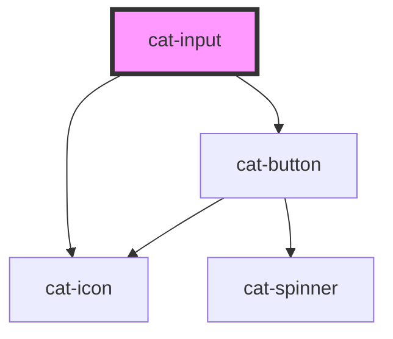

# cat-input

<!-- Auto Generated Below -->

## Properties

| Property       | Attribute       | Description                                                                               | Type                                                                        | Default     |
| -------------- | --------------- | ----------------------------------------------------------------------------------------- | --------------------------------------------------------------------------- | ----------- |
| `autoComplete` | `auto-complete` | Hint for form autofill feature.                                                           | `string \| undefined`                                                       | `undefined` |
| `clearable`    | `clearable`     | Whether the input should show a clear button.                                             | `boolean`                                                                   | `false`     |
| `disabled`     | `disabled`      | Whether the input is disabled.                                                            | `boolean`                                                                   | `false`     |
| `hint`         | `hint`          | Optional hint text to be displayed with the input.                                        | `string \| undefined`                                                       | `undefined` |
| `icon`         | `icon`          | The name of an icon to be displayed in the input.                                         | `string \| undefined`                                                       | `undefined` |
| `iconRight`    | `icon-right`    | Display the icon on the right.                                                            | `boolean`                                                                   | `false`     |
| `label`        | `label`         | The label for the input.                                                                  | `string`                                                                    | `''`        |
| `labelHidden`  | `label-hidden`  | Visually hide the label, but still show it to assistive technologies like screen readers. | `boolean`                                                                   | `false`     |
| `max`          | `max`           | A maximum value for numeric values.                                                       | `number \| undefined`                                                       | `undefined` |
| `maxLength`    | `max-length`    | A maximum length (number of characters) for textual values.                               | `number \| undefined`                                                       | `undefined` |
| `min`          | `min`           | A minimum value for numeric values.                                                       | `number \| undefined`                                                       | `undefined` |
| `minLength`    | `min-length`    | A minimum length (number of characters) for textual values.                               | `number \| undefined`                                                       | `undefined` |
| `name`         | `name`          | The name of the form control. Submitted with the form as part of a name/value pair.       | `string`                                                                    | `''`        |
| `placeholder`  | `placeholder`   | The placeholder text to display within the input.                                         | `string \| undefined`                                                       | `undefined` |
| `readonly`     | `readonly`      | The value is not editable.                                                                | `boolean`                                                                   | `false`     |
| `required`     | `required`      | A value is required or must be check for the form to be submittable.                      | `boolean`                                                                   | `false`     |
| `round`        | `round`         | Use round input edges.                                                                    | `boolean`                                                                   | `false`     |
| `textPrefix`   | `text-prefix`   | A textual prefix to be displayed in the input.                                            | `string \| undefined`                                                       | `undefined` |
| `textSuffix`   | `text-suffix`   | A textual suffix to be displayed in the input.                                            | `string \| undefined`                                                       | `undefined` |
| `type`         | `type`          | Type of form control.                                                                     | `"email" \| "number" \| "password" \| "search" \| "tel" \| "text" \| "url"` | `'text'`    |
| `value`        | `value`         | The initial value of the control.                                                         | `number \| string \| undefined`                                             | `undefined` |

## Events

| Event       | Description                            | Type                      |
| ----------- | -------------------------------------- | ------------------------- |
| `catBlur`   | Emitted when the input loses focus.    | `CustomEvent<FocusEvent>` |
| `catChange` | Emitted when the value is changed.     | `CustomEvent<any>`        |
| `catFocus`  | Emitted when the input received focus. | `CustomEvent<FocusEvent>` |

## Methods

### `clear() => Promise<void>`

Clear the input.

#### Returns

Type: `Promise<void>`

### `setFocus(options?: FocusOptions | undefined) => Promise<void>`

Sets focus on the input. Use this method instead of `input.focus()`.

#### Returns

Type: `Promise<void>`

## Slots

| Slot      | Description                                                                                                          |
| --------- | -------------------------------------------------------------------------------------------------------------------- |
| `"label"` | The slotted label. If both the label property and the label slot are present, only the label slot will be displayed. |

## Shadow Parts

| Part       | Description        |
| ---------- | ------------------ |
| `"label"`  | The label content. |
| `"prefix"` | The text prefix.   |
| `"suffix"` | The text suffix.   |

## Dependencies

### Depends on

- [cat-icon](../cat-icon)
- [cat-button](../cat-button)

### Graph

----------------------------------------------

Made with love in Hamburg, Germany
