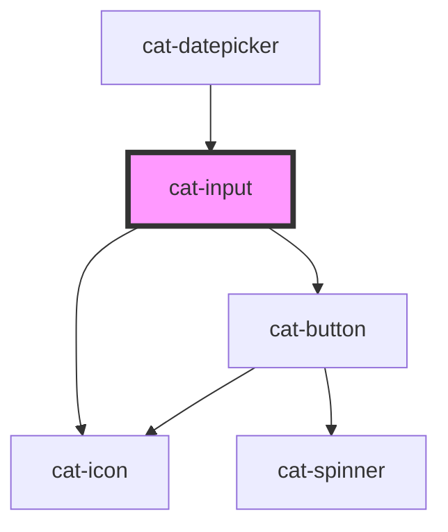

# cat-input

<!-- Auto Generated Below -->

## Overview

Inputs are used to allow users to provide text input when the expected input
is short. As well as plain text, Input supports various types of text,
including passwords and numbers.

## Properties

| Property           | Attribute         | Description                                                                                                                                                                                                                                                                                                                     | Type                                                                                                                                                                                                        | Default      |
| ------------------ | ----------------- | ------------------------------------------------------------------------------------------------------------------------------------------------------------------------------------------------------------------------------------------------------------------------------------------------------------------------------- | ----------------------------------------------------------------------------------------------------------------------------------------------------------------------------------------------------------- | ------------ |
| `autoComplete`     | `auto-complete`   | Hint for form autofill feature.                                                                                                                                                                                                                                                                                                 | `string \| undefined`                                                                                                                                                                                       | `undefined`  |
| `clearable`        | `clearable`       | Whether the input should show a clear button.                                                                                                                                                                                                                                                                                   | `boolean`                                                                                                                                                                                                   | `false`      |
| `disabled`         | `disabled`        | Whether the input is disabled.                                                                                                                                                                                                                                                                                                  | `boolean`                                                                                                                                                                                                   | `false`      |
| `errorUpdate`      | `error-update`    | Fine-grained control over when the errors are shown. Can be `false` to never show errors, `true` to show errors on blur, or a number to show errors on change with the given delay in milliseconds.                                                                                                                             | `boolean \| number`                                                                                                                                                                                         | `0`          |
| `errors`           | `errors`          | The validation errors for this input. Will render a hint under the input with the translated error message(s) `error.${key}`. If an object is passed, the keys will be used as error keys and the values translation parameters. If the value is `true`, the input will be marked as invalid without any hints under the input. | `boolean \| string[] \| undefined \| { [key: string]: any; }`                                                                                                                                               | `undefined`  |
| `hint`             | `hint`            | Optional hint text(s) to be displayed with the input.                                                                                                                                                                                                                                                                           | `string \| string[] \| undefined`                                                                                                                                                                           | `undefined`  |
| `horizontal`       | `horizontal`      | Whether the label is on top or left.                                                                                                                                                                                                                                                                                            | `boolean`                                                                                                                                                                                                   | `false`      |
| `icon`             | `icon`            | The name of an icon to be displayed in the input.                                                                                                                                                                                                                                                                               | `string \| undefined`                                                                                                                                                                                       | `undefined`  |
| `iconRight`        | `icon-right`      | Display the icon on the right.                                                                                                                                                                                                                                                                                                  | `boolean`                                                                                                                                                                                                   | `false`      |
| `identifier`       | `identifier`      | A unique identifier for the input.                                                                                                                                                                                                                                                                                              | `string \| undefined`                                                                                                                                                                                       | `undefined`  |
| `label`            | `label`           | The label for the input.                                                                                                                                                                                                                                                                                                        | `string`                                                                                                                                                                                                    | `''`         |
| `labelHidden`      | `label-hidden`    | Visually hide the label, but still show it to assistive technologies like screen readers.                                                                                                                                                                                                                                       | `boolean`                                                                                                                                                                                                   | `false`      |
| `max`              | `max`             | A maximum value for date, time and numeric values.                                                                                                                                                                                                                                                                              | `number \| string \| undefined`                                                                                                                                                                             | `undefined`  |
| `maxLength`        | `max-length`      | A maximum length (number of characters) for textual values.                                                                                                                                                                                                                                                                     | `number \| undefined`                                                                                                                                                                                       | `undefined`  |
| `min`              | `min`             | A minimum value for date, time and numeric values.                                                                                                                                                                                                                                                                              | `number \| string \| undefined`                                                                                                                                                                             | `undefined`  |
| `minLength`        | `min-length`      | A minimum length (number of characters) for textual values.                                                                                                                                                                                                                                                                     | `number \| undefined`                                                                                                                                                                                       | `undefined`  |
| `name`             | `name`            | The name of the form control. Submitted with the form as part of a name/value pair.                                                                                                                                                                                                                                             | `string \| undefined`                                                                                                                                                                                       | `undefined`  |
| `nativeAttributes` | --                | Attributes that will be added to the native HTML input element.                                                                                                                                                                                                                                                                 | `undefined \| { [key: string]: string; }`                                                                                                                                                                   | `undefined`  |
| `placeholder`      | `placeholder`     | The placeholder text to display within the input.                                                                                                                                                                                                                                                                               | `string \| undefined`                                                                                                                                                                                       | `undefined`  |
| `readonly`         | `readonly`        | The value is not editable.                                                                                                                                                                                                                                                                                                      | `boolean`                                                                                                                                                                                                   | `false`      |
| `required`         | `required`        | A value is required or must be check for the form to be submittable.                                                                                                                                                                                                                                                            | `boolean`                                                                                                                                                                                                   | `false`      |
| `requiredMarker`   | `required-marker` | Whether the label need a marker to shown if the input is required or optional.                                                                                                                                                                                                                                                  | `"none!" \| "none" \| "optional!" \| "optional" \| "required!" \| "required"`                                                                                                                               | `'optional'` |
| `round`            | `round`           | Use round input edges.                                                                                                                                                                                                                                                                                                          | `boolean`                                                                                                                                                                                                   | `false`      |
| `textPrefix`       | `text-prefix`     | A textual prefix to be displayed in the input.                                                                                                                                                                                                                                                                                  | `string \| undefined`                                                                                                                                                                                       | `undefined`  |
| `textSuffix`       | `text-suffix`     | A textual suffix to be displayed in the input.                                                                                                                                                                                                                                                                                  | `string \| undefined`                                                                                                                                                                                       | `undefined`  |
| `type`             | `type`            | Type of form control.                                                                                                                                                                                                                                                                                                           | `"button" \| "color" \| "date" \| "datetime-local" \| "email" \| "file" \| "month" \| "number" \| "password" \| "range" \| "reset" \| "search" \| "submit" \| "tel" \| "text" \| "time" \| "url" \| "week"` | `'text'`     |
| `value`            | `value`           | The value of the control.                                                                                                                                                                                                                                                                                                       | `number \| string \| undefined`                                                                                                                                                                             | `undefined`  |

## Events

| Event       | Description                            | Type                      |
| ----------- | -------------------------------------- | ------------------------- |
| `catBlur`   | Emitted when the input loses focus.    | `CustomEvent<FocusEvent>` |
| `catChange` | Emitted when the value is changed.     | `CustomEvent<any>`        |
| `catFocus`  | Emitted when the input received focus. | `CustomEvent<FocusEvent>` |

## Methods

### `clear() => Promise<void>`

Clear the input.

#### Returns

Type: `Promise<void>`

### `doBlur() => Promise<void>`

Programmatically remove focus from the input. Use this method instead of
`input.blur()`.

#### Returns

Type: `Promise<void>`

### `doClick() => Promise<void>`

Programmatically simulate a click on the input.

#### Returns

Type: `Promise<void>`

### `doFocus(options?: FocusOptions) => Promise<void>`

Programmatically move focus to the input. Use this method instead of
`input.focus()`.

#### Returns

Type: `Promise<void>`

## Slots

| Slot      | Description                                                                                                          |
| --------- | -------------------------------------------------------------------------------------------------------------------- |
| `"hint"`  | Optional hint element to be displayed with the input.                                                                |
| `"label"` | The slotted label. If both the label property and the label slot are present, only the label slot will be displayed. |

## Shadow Parts

| Part       | Description        |
| ---------- | ------------------ |
| `"label"`  | The label content. |
| `"prefix"` | The text prefix.   |
| `"suffix"` | The text suffix.   |

## Dependencies

### Used by

 - [cat-datepicker](../cat-datepicker)

### Depends on

- [cat-icon](../cat-icon)
- [cat-button](../cat-button)

### Graph

----------------------------------------------

Made with love in Hamburg, Germany
