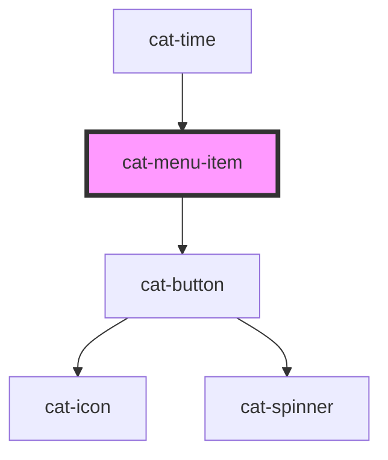

# cat-menu-item

<!-- Auto Generated Below -->

## Overview

A menu item component that renders as a button with proper ARIA semantics.

## Properties

| Property           | Attribute    | Description                                                                                                                                                                                                         | Type                                                                                    | Default     |
| ------------------ | ------------ | ------------------------------------------------------------------------------------------------------------------------------------------------------------------------------------------------------------------- | --------------------------------------------------------------------------------------- | ----------- |
| `active`           | `active`     | Whether the menu item is active.                                                                                                                                                                                    | `boolean`                                                                               | `false`     |
| `color`            | `color`      | The color of the menu item.                                                                                                                                                                                         | `"danger" \| "info" \| "primary" \| "secondary" \| "success" \| "warning" \| undefined` | `undefined` |
| `disabled`         | `disabled`   | Specifies that the menu item should be disabled.                                                                                                                                                                    | `boolean`                                                                               | `false`     |
| `icon`             | `icon`       | The name of an icon to be displayed in the menu item.                                                                                                                                                               | `string \| undefined`                                                                   | `undefined` |
| `iconOnly`         | `icon-only`  | Hide the actual button content and only display the icon.                                                                                                                                                           | `"l" \| "m" \| "s" \| "xl" \| "xs" \| boolean`                                          | `false`     |
| `iconRight`        | `icon-right` | Display the icon on the right.                                                                                                                                                                                      | `boolean`                                                                               | `false`     |
| `identifier`       | `identifier` | A unique identifier for the menu item.                                                                                                                                                                              | `string \| undefined`                                                                   | `undefined` |
| `loading`          | `loading`    | The loading state of the menu item.                                                                                                                                                                                 | `boolean \| undefined`                                                                  | `undefined` |
| `nativeAttributes` | --           | Attributes that will be added to the native HTML button element                                                                                                                                                     | `undefined \| { [key: string]: string; }`                                               | `undefined` |
| `testId`           | `test-id`    | A unique identifier for the underlying native element that is used for testing purposes. The attribute is added as `data-test` attribute and acts as a shorthand for `nativeAttributes={ 'data-test': 'test-Id' }`. | `string \| undefined`                                                                   | `undefined` |
| `url`              | `url`        | A destination to link to, rendered in the href attribute of a link.                                                                                                                                                 | `string \| undefined`                                                                   | `undefined` |
| `urlTarget`        | `url-target` | Specifies where to open the linked document.                                                                                                                                                                        | `"_blank" \| "_self" \| undefined`                                                      | `undefined` |
| `variant`          | `variant`    | The variant of the menu item button.                                                                                                                                                                                | `"filled" \| "outlined" \| "text"`                                                      | `'text'`    |

## Events

| Event      | Description                                 | Type                      |
| ---------- | ------------------------------------------- | ------------------------- |
| `catClick` | Emitted when the trigger button is clicked. | `CustomEvent<MouseEvent>` |

## Methods

### `doBlur() => Promise<void>`

Programmatically remove focus from the menu item.

#### Returns

Type: `Promise<void>`

### `doFocus(options?: FocusOptions) => Promise<void>`

Programmatically move focus to the menu item.

#### Parameters

| Name      | Type                        | Description |
| --------- | --------------------------- | ----------- |
| `options` | `FocusOptions \| undefined` |             |

#### Returns

Type: `Promise<void>`

## Shadow Parts

| Part          | Description |
| ------------- | ----------- |
| `"menu-item"` |             |

## Dependencies

### Used by

 - [cat-time](../cat-time)

### Depends on

- [cat-button](../cat-button)

### Graph

----------------------------------------------

Made with love in Hamburg, Germany
