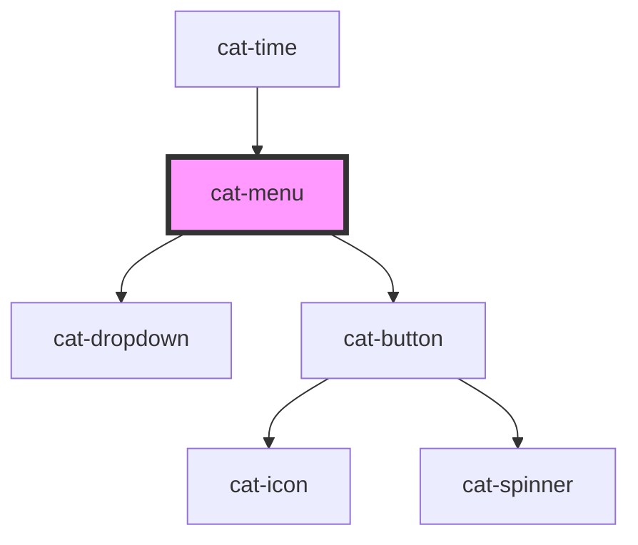

# cat-menu

<!-- Auto Generated Below -->

## Overview

A menu component that provides a dropdown with a built-in configurable trigger button
and proper ARIA semantics and keyboard navigation for menu items.

The trigger is always a cat-button with sensible defaults but fully configurable
through trigger-specific props.

## Properties

| Property                  | Attribute              | Description                                                                                                                                                                                          | Type                                                                                                                                                                 | Default          |
| ------------------------- | ---------------------- | ---------------------------------------------------------------------------------------------------------------------------------------------------------------------------------------------------- | -------------------------------------------------------------------------------------------------------------------------------------------------------------------- | ---------------- |
| `arrowNavigation`         | `arrow-navigation`     | The arrow key navigation direction for menu items.                                                                                                                                                   | `"horizontal" \| "vertical"`                                                                                                                                         | `'vertical'`     |
| `delayedTriggerInit`      | `delayed-trigger-init` | Whether the dropdown trigger should be initialized only before first opening. Can be useful when trigger is rendered dynamically.                                                                    | `boolean`                                                                                                                                                            | `false`          |
| `disabled`                | `disabled`             | Disable the menu.                                                                                                                                                                                    | `boolean`                                                                                                                                                            | `false`          |
| `justify`                 | `justify`              | Make the dropdown match the width of the reference regardless of its contents. Note that this only applies to the minimum width of the dropdown. The maximum width is still limited by the viewport. | `boolean`                                                                                                                                                            | `false`          |
| `noResize`                | `no-resize`            | Do not change the size of the dropdown to ensure it isn’t too big to fit in the viewport (or more specifically, its clipping context).                                                               | `boolean`                                                                                                                                                            | `false`          |
| `overflow`                | `overflow`             | Allow overflow when dropdown is open.                                                                                                                                                                | `boolean`                                                                                                                                                            | `false`          |
| `placement`               | `placement`            | The placement of the dropdown.                                                                                                                                                                       | `"bottom" \| "bottom-end" \| "bottom-start" \| "left" \| "left-end" \| "left-start" \| "right" \| "right-end" \| "right-start" \| "top" \| "top-end" \| "top-start"` | `'bottom-start'` |
| `triggerA11yLabel`        | `trigger-a-1-1y-label` | The trigger button accessibility label. If not set, falls back to triggerLabel.                                                                                                                      | `string \| undefined`                                                                                                                                                | `undefined`      |
| `triggerClass`            | `trigger-class`        | Additional CSS class for the trigger button.                                                                                                                                                         | `string \| undefined`                                                                                                                                                | `undefined`      |
| `triggerColor`            | `trigger-color`        | The color palette of the trigger button.                                                                                                                                                             | `"danger" \| "info" \| "primary" \| "secondary" \| "success" \| "warning"`                                                                                           | `'secondary'`    |
| `triggerIcon`             | `trigger-icon`         | The trigger button icon.                                                                                                                                                                             | `string \| undefined`                                                                                                                                                | `undefined`      |
| `triggerIconOnly`         | `trigger-icon-only`    | Show only the icon in the trigger button.                                                                                                                                                            | `"l" \| "m" \| "s" \| "xl" \| "xs" \| boolean \| undefined`                                                                                                          | `undefined`      |
| `triggerLabel`            | `trigger-label`        | The trigger button label.                                                                                                                                                                            | `string \| undefined`                                                                                                                                                | `undefined`      |
| `triggerNativeAttributes` | --                     | Native attributes for the trigger button.                                                                                                                                                            | `undefined \| { [key: string]: string; }`                                                                                                                            | `undefined`      |
| `triggerSize`             | `trigger-size`         | The trigger button size.                                                                                                                                                                             | `"l" \| "m" \| "s" \| "xl" \| "xs"`                                                                                                                                  | `'m'`            |
| `triggerTestId`           | `trigger-test-id`      | Test ID for the trigger button.                                                                                                                                                                      | `string \| undefined`                                                                                                                                                | `undefined`      |
| `triggerVariant`          | `trigger-variant`      | The trigger button variant.                                                                                                                                                                          | `"filled" \| "outlined" \| "text"`                                                                                                                                   | `'text'`         |

## Events

| Event             | Description                                 | Type                      |
| ----------------- | ------------------------------------------- | ------------------------- |
| `catClose`        | Emitted when the dropdown is closed.        | `CustomEvent<FocusEvent>` |
| `catOpen`         | Emitted when the dropdown is opened.        | `CustomEvent<FocusEvent>` |
| `catTriggerClick` | Emitted when the trigger button is clicked. | `CustomEvent<MouseEvent>` |

## Methods

### `close() => Promise<void>`

Closes the menu.

#### Returns

Type: `Promise<void>`

### `open() => Promise<void>`

Opens the menu.

#### Returns

Type: `Promise<void>`

### `toggle() => Promise<void>`

Toggles the menu.

#### Returns

Type: `Promise<void>`

## Shadow Parts

| Part        | Description |
| ----------- | ----------- |
| `"trigger"` |             |

## Dependencies

### Used by

 - [cat-time](../cat-time)

### Depends on

- [cat-dropdown](../cat-dropdown)
- [cat-button](../cat-button)

### Graph

----------------------------------------------

Made with love in Hamburg, Germany
