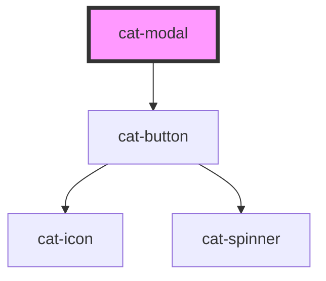

# cat-modal

<!-- Auto Generated Below -->

## Properties

| Property | Attribute | Description            | Type                | Default |
| -------- | --------- | ---------------------- | ------------------- | ------- |
| `size`   | `size`    | The size of the modal. | `"l" \| "m" \| "s"` | `'m'`   |

## Methods

### `show() => Promise<void>`

Shows the modal.

#### Returns

Type: `Promise<void>`

## Dependencies

### Depends on

- [cat-button](../cat-button)

### Graph

----------------------------------------------

Made with love in Hamburg, Germany
