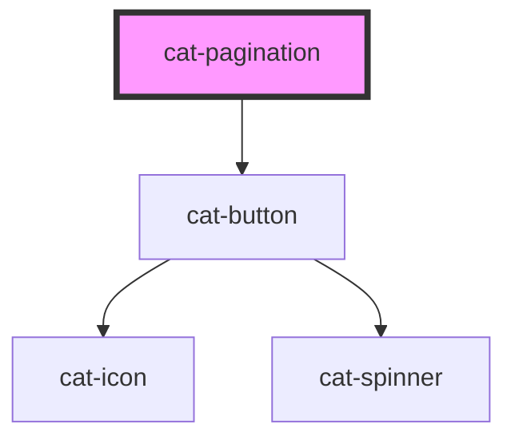

# cat-pagination

<!-- Auto Generated Below -->

## Overview

A navigation component to switch between different pages of paged chunks of
data such as a table. Pagination is built with list HTML elements and a
wrapping `<nav>` element to identify it as a navigation section to screen
readers and other assistive technologies. Furthermore, the current page is
correctly highlighted using `aria-current`.

## Properties

| Property        | Attribute        | Description                                              | Type                                | Default                   |
| --------------- | ---------------- | -------------------------------------------------------- | ----------------------------------- | ------------------------- |
| `activePadding` | `active-padding` | The number of pages to be shown around the current page. | `number`                            | `1`                       |
| `compact`       | `compact`        | Use compact pagination mode.                             | `boolean`                           | `false`                   |
| `iconNext`      | `icon-next`      | The icon of the "next" button.                           | `string`                            | `'$cat:pagination-right'` |
| `iconPrev`      | `icon-prev`      | The icon of the "previous" button.                       | `string`                            | `'$cat:pagination-left'`  |
| `page`          | `page`           | The current page.                                        | `number`                            | `0`                       |
| `pageCount`     | `page-count`     | The total number of pages.                               | `number`                            | `1`                       |
| `round`         | `round`          | Use round button edges.                                  | `boolean`                           | `false`                   |
| `sidePadding`   | `side-padding`   | The number of pages to be shown at the edges.            | `number`                            | `1`                       |
| `size`          | `size`           | The size of the buttons.                                 | `"l" \| "m" \| "s" \| "xl" \| "xs"` | `'m'`                     |
| `variant`       | `variant`        | The rendering style of the buttons.                      | `"filled" \| "outlined" \| "text"`  | `'text'`                  |

## Dependencies

### Depends on

- [cat-button](../cat-button)

### Graph

----------------------------------------------

Made with love in Hamburg, Germany
