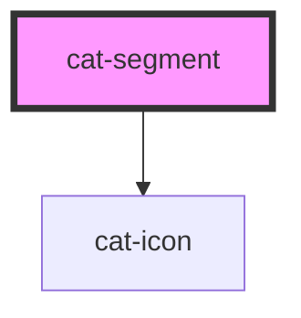

# cat-segment

<!-- Auto Generated Below -->

## Overview

A single segment within a cat-segmented-control.

## Properties

| Property             | Attribute       | Description                                                                                                                                                                            | Type                                      | Default     |
| -------------------- | --------------- | -------------------------------------------------------------------------------------------------------------------------------------------------------------------------------------- | ----------------------------------------- | ----------- |
| `a11yControls`       | `a11y-controls` | Refers to the element that is controlled (e.g. displayed or hidden) by this segment. Typically, this is the ID of a tab panel that is shown when this segment is active.               | `string \| undefined`                     | `undefined` |
| `a11yLabel`          | `a11y-label`    | Adds accessible label for the button that is only shown for screen readers. Typically, this label text replaces the visible text on the button for users who use assistive technology. | `string \| undefined`                     | `undefined` |
| `disabled`           | `disabled`      | Whether this segment is disabled.                                                                                                                                                      | `boolean`                                 | `false`     |
| `icon`               | `icon`          | Icon name to display (same registry as cat-button).                                                                                                                                    | `string \| undefined`                     | `undefined` |
| `iconOnly`           | `icon-only`     | When true, hides the label and shows the icon only. Requires icon and a11y-label.                                                                                                      | `boolean`                                 | `false`     |
| `nativeAttributes`   | --              | Spread onto the native button element.                                                                                                                                                 | `undefined \| { [key: string]: string; }` | `undefined` |
| `testId`             | `test-id`       | Renders as data-test on the button element.                                                                                                                                            | `string \| undefined`                     | `undefined` |
| `value` _(required)_ | `value`         | The unique value of this segment within the group.                                                                                                                                     | `string`                                  | `undefined` |

## Methods

### `doBlur() => Promise<void>`

Removes focus from the segment button.

#### Returns

Type: `Promise<void>`

### `doFocus() => Promise<void>`

Sets focus on the segment button.

#### Returns

Type: `Promise<void>`

## Shadow Parts

| Part       | Description                |
| ---------- | -------------------------- |
| `"button"` | The native button element. |

## Dependencies

### Depends on

- [cat-icon](../cat-icon)

### Graph

----------------------------------------------

Made with love in Hamburg, Germany
