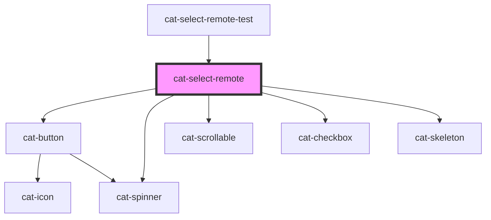

# cat-select-remote

<!-- Auto Generated Below -->

## Properties

| Property      | Attribute      | Description                                                                               | Type                                                                                                                                                                 | Default          |
| ------------- | -------------- | ----------------------------------------------------------------------------------------- | -------------------------------------------------------------------------------------------------------------------------------------------------------------------- | ---------------- |
| `clearable`   | `clearable`    | Whether the select should show a clear button.                                            | `boolean`                                                                                                                                                            | `false`          |
| `debounce`    | `debounce`     | The debounce time for the search.                                                         | `number`                                                                                                                                                             | `250`            |
| `disabled`    | `disabled`     | Whether the select is disabled.                                                           | `boolean`                                                                                                                                                            | `false`          |
| `hint`        | `hint`         | Optional hint text(s) to be displayed with the select.                                    | `string \| string[] \| undefined`                                                                                                                                    | `undefined`      |
| `label`       | `label`        | The label for the select.                                                                 | `string`                                                                                                                                                             | `''`             |
| `labelHidden` | `label-hidden` | Visually hide the label, but still show it to assistive technologies like screen readers. | `boolean`                                                                                                                                                            | `false`          |
| `multiple`    | `multiple`     | Enable multiple selection.                                                                | `boolean`                                                                                                                                                            | `false`          |
| `name`        | `name`         | The name of the form control. Submitted with the form as part of a name/value pair.       | `string`                                                                                                                                                             | `''`             |
| `placeholder` | `placeholder`  | The placeholder text to display within the select.                                        | `string \| undefined`                                                                                                                                                | `undefined`      |
| `placement`   | `placement`    | The placement of the select.                                                              | `"bottom" \| "bottom-end" \| "bottom-start" \| "left" \| "left-end" \| "left-start" \| "right" \| "right-end" \| "right-start" \| "top" \| "top-end" \| "top-start"` | `'bottom-start'` |
| `required`    | `required`     | A value is required or must be check for the form to be submittable.                      | `boolean`                                                                                                                                                            | `false`          |
| `value`       | `value`        | The value of the select.                                                                  | `string \| string[] \| undefined`                                                                                                                                    | `undefined`      |

## Events

| Event       | Description                                 | Type                      |
| ----------- | ------------------------------------------- | ------------------------- |
| `catChange` | Emitted when the value is changed.          | `CustomEvent<any>`        |
| `catClose`  | Emitted when the select dropdown is closed. | `CustomEvent<FocusEvent>` |
| `catOpen`   | Emitted when the select dropdown is opened. | `CustomEvent<FocusEvent>` |

## Methods

### `connect(connector: CatSelectRemoteConnector) => Promise<void>`

#### Returns

Type: `Promise<void>`

## Shadow Parts

| Part      | Description |
| --------- | ----------- |
| `"label"` |             |

## Dependencies

### Used by

 - [cat-select-remote-test](../cat-select-remote-test)

### Depends on

- [cat-button](../cat-button)
- [cat-spinner](../cat-spinner)
- [cat-scrollable](../cat-scrollable)
- [cat-checkbox](../cat-checkbox)
- [cat-skeleton](../cat-skeleton)

### Graph

----------------------------------------------

Made with love in Hamburg, Germany
