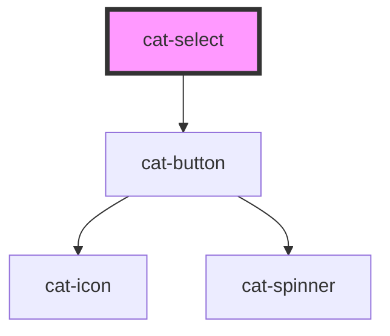

# cat-select

<!-- Auto Generated Below -->

## Properties

| Property      | Attribute      | Description                                                                                                                                                                                              | Type                                                    | Default     |
| ------------- | -------------- | -------------------------------------------------------------------------------------------------------------------------------------------------------------------------------------------------------- | ------------------------------------------------------- | ----------- |
| `choices`     | --             | The available options for the input.                                                                                                                                                                     | `Choice[]`                                              | `[]`        |
| `disabled`    | `disabled`     | Disable the select.                                                                                                                                                                                      | `boolean`                                               | `false`     |
| `hint`        | `hint`         | Optional hint text(s) to be displayed with the select.                                                                                                                                                   | `string \| string[] \| undefined`                       | `undefined` |
| `label`       | `label`        | The label for the select.                                                                                                                                                                                | `string`                                                | `''`        |
| `labelHidden` | `label-hidden` | Visually hide the label, but still show it to assistive technologies like screen readers.                                                                                                                | `boolean`                                               | `false`     |
| `multiple`    | `multiple`     | Enable multiple selection.                                                                                                                                                                               | `boolean`                                               | `false`     |
| `noSearch`    | `no-search`    | Enable search for the select.                                                                                                                                                                            | `boolean`                                               | `false`     |
| `placeholder` | `placeholder`  | The placeholder for the select.                                                                                                                                                                          | `string`                                                | `''`        |
| `position`    | `position`     | Whether the dropdown should appear above `(top)` or below `(bottom)` the input. By default, if there is not enough space within the window the dropdown will appear above the input, otherwise below it. | `"auto" \| "bottom" \| "top"`                           | `'auto'`    |
| `required`    | `required`     | A value is required or must be check for the form to be submittable.                                                                                                                                     | `boolean`                                               | `false`     |
| `value`       | `value`        | The pre-selected items for the input.                                                                                                                                                                    | `Choice \| Choice[] \| string \| string[] \| undefined` | `undefined` |

## Events

| Event               | Description                           | Type                      |
| ------------------- | ------------------------------------- | ------------------------- |
| `catBlur`           | Emitted when the select loses focus.  | `CustomEvent<FocusEvent>` |
| `catChange`         | Emitted when the value is changed.    | `CustomEvent<any>`        |
| `catScrolledBottom` | Emitted when scrolled to the bottom.  | `CustomEvent<any>`        |
| `catSearch`         | Emitted when the search is triggered. | `CustomEvent<any>`        |

## Methods

### `clearChoices() => Promise<this>`

Clear all choices from select.

#### Returns

Type: `Promise<this>`

### `clearInput() => Promise<this>`

Clear input of any user inputted text.

#### Returns

Type: `Promise<this>`

### `setChoices(choices: Array<Choice> | Array<Group>, value?: string | undefined, label?: string | undefined, replaceChoices?: boolean | undefined) => Promise<this>`

Set choices of select input via an array of objects (or function that
returns array of object or promise of it), a value field name and a label
field name.

#### Returns

Type: `Promise<this>`

### `setValue(args: Array<string> | Array<Item>) => Promise<this>`

Set value of input based on an array of objects or strings. This behaves
exactly the same as passing items via the items option but can be called
after initialisation.

#### Returns

Type: `Promise<this>`

## Slots

| Slot      | Description                                                                                                          |
| --------- | -------------------------------------------------------------------------------------------------------------------- |
| `"hint"`  | Optional hint element to be displayed with the select.                                                               |
| `"label"` | The slotted label. If both the label property and the label slot are present, only the label slot will be displayed. |

## Shadow Parts

| Part      | Description        |
| --------- | ------------------ |
| `"label"` | The label content. |

## Dependencies

### Depends on

- [cat-button](../cat-button)

### Graph

----------------------------------------------

Made with love in Hamburg, Germany
