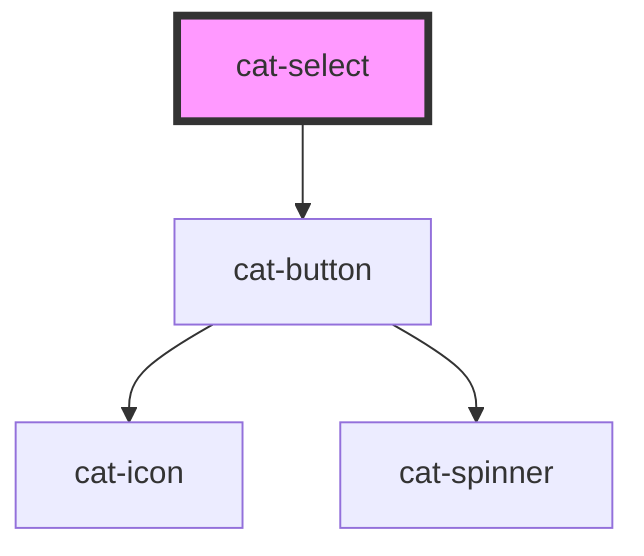

# cat-select

<!-- Auto Generated Below -->

## Properties

| Property              | Attribute               | Description | Type                                                                    | Default     |
| --------------------- | ----------------------- | ----------- | ----------------------------------------------------------------------- | ----------- |
| `addItemFilter`       | `add-item-filter`       |             | `((value: string) => boolean) \| RegExp \| null \| string \| undefined` | `undefined` |
| `addItems`            | `add-items`             |             | `boolean`                                                               | `true`      |
| `choices`             | --                      |             | `Option[] \| undefined`                                                 | `undefined` |
| `delimiter`           | `delimiter`             |             | `string`                                                                | `''`        |
| `disabled`            | `disabled`              |             | `boolean`                                                               | `false`     |
| `editItems`           | `edit-items`            |             | `boolean`                                                               | `false`     |
| `items`               | --                      |             | `Choice[] \| string[] \| undefined`                                     | `undefined` |
| `maxItemCount`        | `max-item-count`        |             | `boolean`                                                               | `false`     |
| `multiple`            | `multiple`              |             | `boolean`                                                               | `false`     |
| `paste`               | `paste`                 |             | `boolean`                                                               | `false`     |
| `placeholder`         | `placeholder`           |             | `string`                                                                | `''`        |
| `position`            | `position`              |             | `"auto" \| "bottom" \| "top"`                                           | `'auto'`    |
| `removeItemButton`    | `remove-item-button`    |             | `boolean`                                                               | `true`      |
| `resetScrollPosition` | `reset-scroll-position` |             | `boolean`                                                               | `false`     |
| `searchChoices`       | `search-choices`        |             | `boolean`                                                               | `true`      |
| `searchFields`        | `search-fields`         |             | `string \| string[] \| undefined`                                       | `undefined` |
| `searchable`          | `searchable`            |             | `boolean`                                                               | `true`      |
| `valueComparer`       | --                      |             | `((value1: string, value2: string) => boolean) \| undefined`            | `undefined` |

## Events

| Event       | Description | Type               |
| ----------- | ----------- | ------------------ |
| `catChange` |             | `CustomEvent<any>` |

## Methods

### `clearChoices() => Promise<this>`

#### Returns

Type: `Promise<this>`

### `clearInput() => Promise<this>`

#### Returns

Type: `Promise<this>`

### `clearStore() => Promise<this>`

#### Returns

Type: `Promise<this>`

### `setChoiceByValue(value: string) => Promise<this>`

#### Returns

Type: `Promise<this>`

### `setChoices(choices: Array<Choice> | Array<Group>, value: string, label: string, replaceChoices?: boolean | undefined) => Promise<this>`

#### Returns

Type: `Promise<this>`

### `setValue(args: Array<string> | Array<Item>) => Promise<this>`

#### Returns

Type: `Promise<this>`

## Dependencies

### Depends on

- [cat-button](../cat-button)

### Graph

----------------------------------------------

Made with love in Hamburg, Germany
