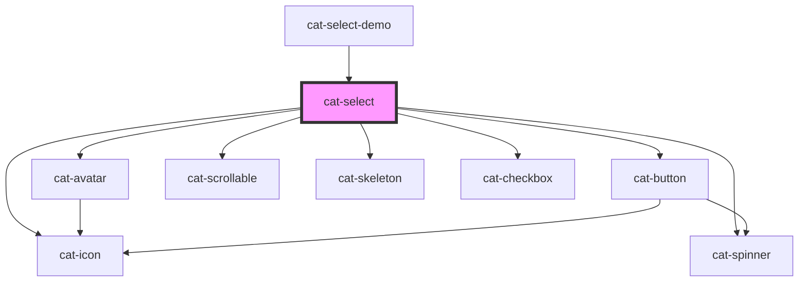

# cat-select

<!-- Auto Generated Below -->

## Overview

Select lets user choose one option from an options' menu. Consider using
select when you have 6 or more options. Select component supports any content
type.

## Properties

| Property           | Attribute          | Description                                                                                                                                                                                                                                                                                                                                                                                                                                                                                                                                                                                                                                                                                                    | Type                                                                                                                                                                 | Default          |
| ------------------ | ------------------ | -------------------------------------------------------------------------------------------------------------------------------------------------------------------------------------------------------------------------------------------------------------------------------------------------------------------------------------------------------------------------------------------------------------------------------------------------------------------------------------------------------------------------------------------------------------------------------------------------------------------------------------------------------------------------------------------------------------- | -------------------------------------------------------------------------------------------------------------------------------------------------------------------- | ---------------- |
| `clearable`        | `clearable`        | Whether the select should show a clear button.                                                                                                                                                                                                                                                                                                                                                                                                                                                                                                                                                                                                                                                                 | `boolean`                                                                                                                                                            | `false`          |
| `debounce`         | `debounce`         | The debounce time for the search.                                                                                                                                                                                                                                                                                                                                                                                                                                                                                                                                                                                                                                                                              | `number`                                                                                                                                                             | `250`            |
| `disableDropdown`  | `disable-dropdown` | Property for tag inputs that disables the dropdown functionality                                                                                                                                                                                                                                                                                                                                                                                                                                                                                                                                                                                                                                               | `boolean`                                                                                                                                                            | `false`          |
| `disabled`         | `disabled`         | Whether the select is disabled.                                                                                                                                                                                                                                                                                                                                                                                                                                                                                                                                                                                                                                                                                | `boolean`                                                                                                                                                            | `false`          |
| `errorUpdate`      | `error-update`     | Fine-grained control over when the errors are shown. Can be `false` to never show errors, `true` to show errors on blur, or a number to show errors on change with the given delay in milliseconds.                                                                                                                                                                                                                                                                                                                                                                                                                                                                                                            | `boolean \| number`                                                                                                                                                  | `0`              |
| `errors`           | `errors`           | The validation errors for this input. Will render a hint under the input with the translated error message(s) `error.${key}`. If an object is passed, the keys will be used as error keys and the values translation parameters. If the value is `true`, the input will be marked as invalid without any hints under the input.                                                                                                                                                                                                                                                                                                                                                                                | `boolean \| string[] \| undefined \| { [key: string]: any; }`                                                                                                        | `undefined`      |
| `hint`             | `hint`             | Optional hint text(s) to be displayed with the select.                                                                                                                                                                                                                                                                                                                                                                                                                                                                                                                                                                                                                                                         | `string \| string[] \| undefined`                                                                                                                                    | `undefined`      |
| `horizontal`       | `horizontal`       | Whether the label is on top or left.                                                                                                                                                                                                                                                                                                                                                                                                                                                                                                                                                                                                                                                                           | `boolean`                                                                                                                                                            | `false`          |
| `identifier`       | `identifier`       | A unique identifier for the input.                                                                                                                                                                                                                                                                                                                                                                                                                                                                                                                                                                                                                                                                             | `string \| undefined`                                                                                                                                                | `undefined`      |
| `label`            | `label`            | The label for the select.                                                                                                                                                                                                                                                                                                                                                                                                                                                                                                                                                                                                                                                                                      | `string`                                                                                                                                                             | `''`             |
| `labelHidden`      | `label-hidden`     | Visually hide the label, but still show it to assistive technologies like screen readers.                                                                                                                                                                                                                                                                                                                                                                                                                                                                                                                                                                                                                      | `boolean`                                                                                                                                                            | `false`          |
| `multiple`         | `multiple`         | Enable multiple selection.                                                                                                                                                                                                                                                                                                                                                                                                                                                                                                                                                                                                                                                                                     | `boolean`                                                                                                                                                            | `false`          |
| `name`             | `name`             | The name of the form control. Submitted with the form as part of a name/value pair.                                                                                                                                                                                                                                                                                                                                                                                                                                                                                                                                                                                                                            | `string \| undefined`                                                                                                                                                | `undefined`      |
| `nativeAttributes` | --                 | Attributes that will be added to the native HTML input element.                                                                                                                                                                                                                                                                                                                                                                                                                                                                                                                                                                                                                                                | `undefined \| { [key: string]: string; }`                                                                                                                            | `undefined`      |
| `noItems`          | `no-items`         | The text to display in the dropdown if no results are found.                                                                                                                                                                                                                                                                                                                                                                                                                                                                                                                                                                                                                                                   | `string \| undefined`                                                                                                                                                | `undefined`      |
| `placeholder`      | `placeholder`      | The placeholder text to display within the select.                                                                                                                                                                                                                                                                                                                                                                                                                                                                                                                                                                                                                                                             | `string \| undefined`                                                                                                                                                | `undefined`      |
| `placement`        | `placement`        | The placement of the select.                                                                                                                                                                                                                                                                                                                                                                                                                                                                                                                                                                                                                                                                                   | `"bottom" \| "bottom-end" \| "bottom-start" \| "left" \| "left-end" \| "left-start" \| "right" \| "right-end" \| "right-start" \| "top" \| "top-end" \| "top-start"` | `'bottom-start'` |
| `required`         | `required`         | A value is required or must be checked for the form to be submittable.                                                                                                                                                                                                                                                                                                                                                                                                                                                                                                                                                                                                                                         | `boolean`                                                                                                                                                            | `false`          |
| `requiredMarker`   | `required-marker`  | Whether the label need a marker to shown if the select is required or optional.                                                                                                                                                                                                                                                                                                                                                                                                                                                                                                                                                                                                                                | `"none!" \| "none" \| "optional!" \| "optional" \| "required!" \| "required" \| undefined`                                                                           | `'optional'`     |
| `tagCreationKeys`  | --                 |                                                                                                                                                                                                                                                                                                                                                                                                                                                                                                                                                                                                                                                                                                                | `string[]`                                                                                                                                                           | `['Enter']`      |
| `tagHint`          | `tag-hint`         | Optional hint text to be displayed on the new item to be added.                                                                                                                                                                                                                                                                                                                                                                                                                                                                                                                                                                                                                                                | `string \| undefined`                                                                                                                                                | `undefined`      |
| `tags`             | `tags`             | Whether the select should add new items.                                                                                                                                                                                                                                                                                                                                                                                                                                                                                                                                                                                                                                                                       | `boolean`                                                                                                                                                            | `false`          |
| `value`            | `value`            | The value of the select.     The value of the select depends on whether it is allowed to choose a single item or several items.   When only one item can be selected, the value is the id of the item, in case several items can be selected, the value is an array of ids of the selected items.     In case the user can add new items to the select (tags activated), the value in the single select is an object (CatSelectTaggingValue) with the id of the item or the name of the created item, in the case of multiple select, it is an object (CatSelectMultipleTaggingValue) with the array of the ids of the items selected and the array of the names of the items created | `CatSelectMultipleTaggingValue \| CatSelectTaggingValue \| string \| string[] \| undefined`                                                                          | `undefined`      |

## Events

| Event       | Description                                 | Type                      |
| ----------- | ------------------------------------------- | ------------------------- |
| `catBlur`   | Emitted when the select loses the focus.    | `CustomEvent<FocusEvent>` |
| `catChange` | Emitted when the value is changed.          | `CustomEvent<InputEvent>` |
| `catClose`  | Emitted when the select dropdown is closed. | `CustomEvent<FocusEvent>` |
| `catOpen`   | Emitted when the select dropdown is opened. | `CustomEvent<FocusEvent>` |

## Methods

### `clear() => Promise<void>`

Clear the input.

#### Returns

Type: `Promise<void>`

### `connect(connector: CatSelectConnector) => Promise<void>`

Connect the functions of the select

#### Parameters

| Name        | Type                      | Description                                     |
| ----------- | ------------------------- | ----------------------------------------------- |
| `connector` | `CatSelectConnector<any>` | - The {@link CatSelectConnector} of the select. |

#### Returns

Type: `Promise<void>`

### `doBlur() => Promise<void>`

Programmatically remove focus from the input. Use this method instead of
`input.blur()`.

#### Returns

Type: `Promise<void>`

### `doFocus(options?: FocusOptions) => Promise<void>`

Programmatically move focus to the input. Use this method instead of
`input.focus()`.

#### Parameters

| Name      | Type                        | Description                                                                      |
| --------- | --------------------------- | -------------------------------------------------------------------------------- |
| `options` | `FocusOptions \| undefined` | An optional object providing options to control aspects of the focusing process. |

#### Returns

Type: `Promise<void>`

## Slots

| Slot      | Description                                                                                                          |
| --------- | -------------------------------------------------------------------------------------------------------------------- |
| `"hint"`  | Optional hint element to be displayed with the select.                                                               |
| `"label"` | The slotted label. If both the label property and the label slot are present, only the label slot will be displayed. |

## Shadow Parts

| Part      | Description               |
| --------- | ------------------------- |
| `"input"` | The native input element. |
| `"label"` | The native label element. |

## Dependencies

### Used by

 - [cat-select-demo](../cat-select-demo)

### Depends on

- [cat-avatar](../cat-avatar)
- [cat-button](../cat-button)
- [cat-spinner](../cat-spinner)
- [cat-icon](../cat-icon)
- [cat-scrollable](../cat-scrollable)
- [cat-skeleton](../cat-skeleton)
- [cat-checkbox](../cat-checkbox)

### Graph

----------------------------------------------

Made with love in Hamburg, Germany
