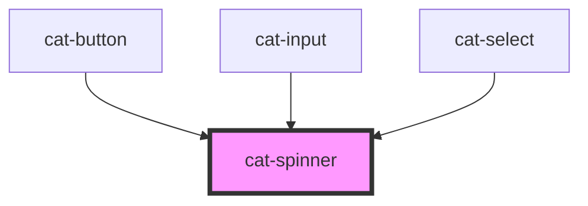

# cat-spinner

<!-- Auto Generated Below -->

## Overview

Spinners are used to indicate users that their action is being processed.

## Properties

| Property    | Attribute    | Description                                                                                                                                  | Type                                            | Default     |
| ----------- | ------------ | -------------------------------------------------------------------------------------------------------------------------------------------- | ----------------------------------------------- | ----------- |
| `a11yLabel` | `a11y-label` | Adds accessible label for the spinner that is only shown for screen readers. The `aria-hidden` attribute will be set if no label is present. | `string \| undefined`                           | `undefined` |
| `size`      | `size`       | The size of the spinner.                                                                                                                     | `"inline" \| "l" \| "m" \| "s" \| "xl" \| "xs"` | `'m'`       |
| `value`     | `value`      | Value of the progress bar. Defaults to zero. Mirrored to aria-valuenow.                                                                      | `number`                                        | `0`         |

## Dependencies

### Used by

 - [cat-button](../cat-button)
 - [cat-input](../cat-input)
 - [cat-select](../cat-select)

### Graph

----------------------------------------------

Made with love in Hamburg, Germany
