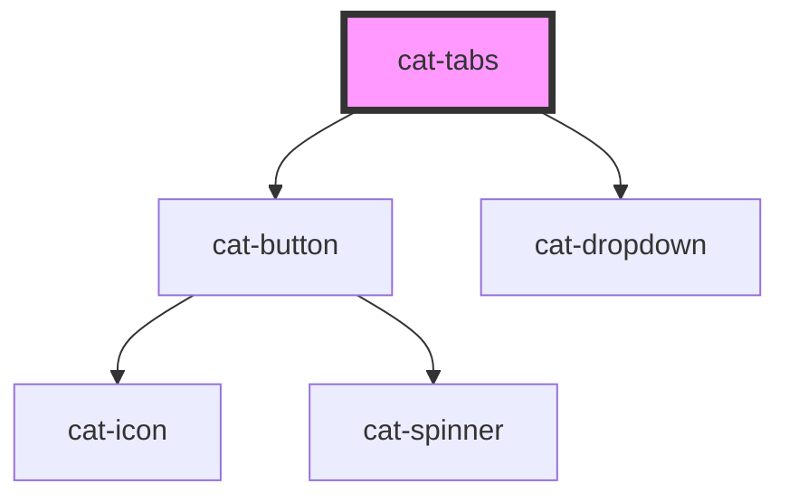

# cat-tabs

<!-- Auto Generated Below -->

## Overview

Tabs are used to display multiple panels to be contained within a single
window, using tabs as a navigational element.

## Properties

| Property                 | Attribute                   | Description                                                                                                                                         | Type                                         | Default  |
| ------------------------ | --------------------------- | --------------------------------------------------------------------------------------------------------------------------------------------------- | -------------------------------------------- | -------- |
| `activeTab`              | `active-tab`                | The ID of the active tab.                                                                                                                           | `string`                                     | `''`     |
| `activeTabAlwaysVisible` | `active-tab-always-visible` | Whether the active tab should always be visible. Applied when adaptive is enabled. Has less priority than sticky if there is no space to show both. | `boolean`                                    | `false`  |
| `adaptive`               | `adaptive`                  | Whether the visible items change according to the available space. A 'More' button is used to reveal hidden items.                                  | `boolean`                                    | `false`  |
| `tabsAlign`              | `tabs-align`                | The alignment of the tabs.                                                                                                                          | `"center" \| "justify" \| "left" \| "right"` | `'left'` |

## Events

| Event       | Description                         | Type                                                                 |
| ----------- | ----------------------------------- | -------------------------------------------------------------------- |
| `catChange` | Emitted when active tab is changed. | `CustomEvent<{ id: string; index: number; fromDropdown: boolean; }>` |

## Methods

### `setActive(id: string) => Promise<void>`

Activates the tab with the given id.

#### Parameters

| Name | Type     | Description |
| ---- | -------- | ----------- |
| `id` | `string` | The tab id. |

#### Returns

Type: `Promise<void>`

### `setActiveIndex(index: number) => Promise<void>`

Activates the tab with the given index.

#### Parameters

| Name    | Type     | Description    |
| ------- | -------- | -------------- |
| `index` | `number` | The tab index. |

#### Returns

Type: `Promise<void>`

### `updateAdaptiveTabs() => Promise<void>`

Recalculates visible and hidden adaptive tabs.

#### Returns

Type: `Promise<void>`

## Shadow Parts

| Part     | Description                                         |
| -------- | --------------------------------------------------- |
| `"more"` | An optional more button to display additional tabs. |
| `"tab"`  | The header of the tab.                              |

## Dependencies

### Depends on

- [cat-button](../cat-button)
- [cat-dropdown](../cat-dropdown)

### Graph

----------------------------------------------

Made with love in Hamburg, Germany
