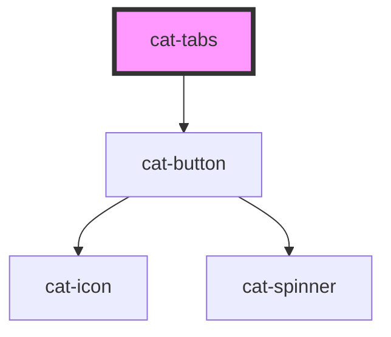

# cat-tabs

<!-- Auto Generated Below -->

## Properties

| Property    | Attribute    | Description               | Type                              | Default  |
| ----------- | ------------ | ------------------------- | --------------------------------- | -------- |
| `activeTab` | `active-tab` | The ID of the active tab. | `string`                          | `''`     |
| `tabsAlign` | `tabs-align` | The tabs alignment        | `"center" \| "justify" \| "left"` | `'left'` |

## Shadow Parts

| Part    | Description            |
| ------- | ---------------------- |
| `"tab"` | The header of the tab. |

## Dependencies

### Depends on

- [cat-button](../cat-button)

### Graph

----------------------------------------------

Made with love in Hamburg, Germany
