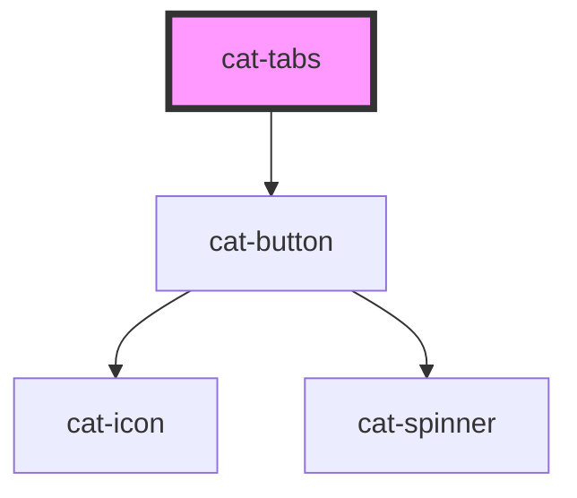

# cat-tabs

<!-- Auto Generated Below -->

## Overview

Tabs are used to display multiple panels to be contained within a single
window, using tabs as a navigational element.

## Properties

| Property    | Attribute    | Description                | Type                                         | Default  |
| ----------- | ------------ | -------------------------- | -------------------------------------------- | -------- |
| `activeTab` | `active-tab` | The ID of the active tab.  | `string`                                     | `''`     |
| `tabsAlign` | `tabs-align` | The alignment of the tabs. | `"center" \| "justify" \| "left" \| "right"` | `'left'` |

## Events

| Event       | Description                         | Type                                          |
| ----------- | ----------------------------------- | --------------------------------------------- |
| `catChange` | Emitted when active tab is changed. | `CustomEvent<{ id: string; index: number; }>` |

## Methods

### `setActive(id: string) => Promise<void>`

Activates the tab with the given id.

#### Returns

Type: `Promise<void>`

### `setActiveIndex(index: number) => Promise<void>`

Activates the tab with the given index.

#### Returns

Type: `Promise<void>`

## Shadow Parts

| Part    | Description            |
| ------- | ---------------------- |
| `"tab"` | The header of the tab. |

## Dependencies

### Depends on

- [cat-button](../cat-button)

### Graph

----------------------------------------------

Made with love in Hamburg, Germany
