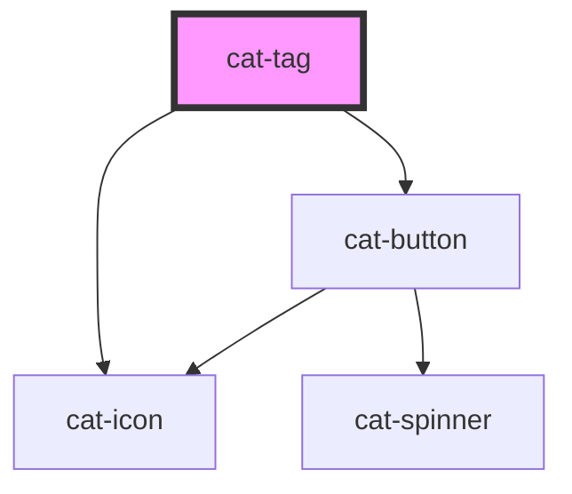

# cat-tag

<!-- Auto Generated Below -->

## Properties

| Property           | Attribute         | Description                                                                                                                                                                                                                                                                                                                     | Type                                                                                       | Default      |
| ------------------ | ----------------- | ------------------------------------------------------------------------------------------------------------------------------------------------------------------------------------------------------------------------------------------------------------------------------------------------------------------------------- | ------------------------------------------------------------------------------------------ | ------------ |
| `clearable`        | `clearable`       | Whether the input should show a clear button.                                                                                                                                                                                                                                                                                   | `boolean`                                                                                  | `false`      |
| `disabled`         | `disabled`        | Whether the select is disabled.                                                                                                                                                                                                                                                                                                 | `boolean`                                                                                  | `false`      |
| `errorUpdate`      | `error-update`    | Fine-grained control over when the errors are shown. Can be `false` to never show errors, `true` to show errors on blur, or a number to show errors on change with the given delay in milliseconds.                                                                                                                             | `boolean \| number`                                                                        | `0`          |
| `errors`           | `errors`          | The validation errors for this input. Will render a hint under the input with the translated error message(s) `error.${key}`. If an object is passed, the keys will be used as error keys and the values translation parameters. If the value is `true`, the input will be marked as invalid without any hints under the input. | `boolean \| string[] \| undefined \| { [key: string]: any; }`                              | `undefined`  |
| `hint`             | `hint`            | Optional hint text(s) to be displayed with the select.                                                                                                                                                                                                                                                                          | `string \| string[] \| undefined`                                                          | `undefined`  |
| `identifier`       | `identifier`      | A unique identifier for the input.                                                                                                                                                                                                                                                                                              | `string \| undefined`                                                                      | `undefined`  |
| `label`            | `label`           | The label for the select.                                                                                                                                                                                                                                                                                                       | `string`                                                                                   | `''`         |
| `labelHidden`      | `label-hidden`    | Visually hide the label, but still show it to assistive technologies like screen readers.                                                                                                                                                                                                                                       | `boolean`                                                                                  | `false`      |
| `name`             | `name`            | The name of the form control. Submitted with the form as part of a name/value pair.                                                                                                                                                                                                                                             | `string \| undefined`                                                                      | `undefined`  |
| `nativeAttributes` | --                | Attributes that will be added to the native HTML input element.                                                                                                                                                                                                                                                                 | `undefined \| { [key: string]: string; }`                                                  | `undefined`  |
| `placeholder`      | `placeholder`     | The placeholder text to display within the select.                                                                                                                                                                                                                                                                              | `string \| undefined`                                                                      | `undefined`  |
| `required`         | `required`        | A value is required or must be checked for the form to be submittable.                                                                                                                                                                                                                                                          | `boolean`                                                                                  | `false`      |
| `requiredMarker`   | `required-marker` | Whether the label need a marker to shown if the select is required or optional.                                                                                                                                                                                                                                                 | `"none!" \| "none" \| "optional!" \| "optional" \| "required!" \| "required" \| undefined` | `'optional'` |
| `tagCreationChars` | --                | List of characters that should create a new tag. This need to be comparable to `keydownEvent.key`. Pasted values will also be split by those chars. Defaults to `[' ']`.                                                                                                                                                        | `string[]`                                                                                 | `[' ']`      |
| `value`            | --                | The value of the control.                                                                                                                                                                                                                                                                                                       | `string[] \| undefined`                                                                    | `undefined`  |

## Events

| Event       | Description                            | Type                      |
| ----------- | -------------------------------------- | ------------------------- |
| `catBlur`   | Emitted when the input loses focus.    | `CustomEvent<FocusEvent>` |
| `catChange` | Emitted when the value is changed.     | `CustomEvent<string[]>`   |
| `catFocus`  | Emitted when the input received focus. | `CustomEvent<FocusEvent>` |

## Shadow Parts

| Part      | Description |
| --------- | ----------- |
| `"input"` |             |
| `"label"` |             |

## Dependencies

### Depends on

- [cat-button](../cat-button)
- [cat-icon](../cat-icon)

### Graph

----------------------------------------------

Made with love in Hamburg, Germany
