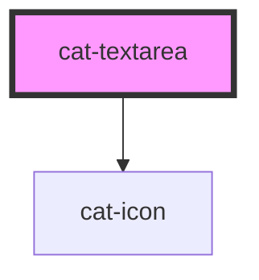

# cat-textarea

<!-- Auto Generated Below -->

## Properties

| Property           | Attribute         | Description                                                                                                                                                                                                                                                                                                                     | Type                                                                          | Default      |
| ------------------ | ----------------- | ------------------------------------------------------------------------------------------------------------------------------------------------------------------------------------------------------------------------------------------------------------------------------------------------------------------------------- | ----------------------------------------------------------------------------- | ------------ |
| `disabled`         | `disabled`        | Whether the textarea is disabled.                                                                                                                                                                                                                                                                                               | `boolean`                                                                     | `false`      |
| `errorUpdate`      | `error-update`    | Fine-grained control over when the errors are shown. Can be `false` to never show errors, `true` to show errors on blur, or a number to show errors on change with the given delay in milliseconds.                                                                                                                             | `boolean \| number`                                                           | `0`          |
| `errors`           | `errors`          | The validation errors for this input. Will render a hint under the input with the translated error message(s) `error.${key}`. If an object is passed, the keys will be used as error keys and the values translation parameters. If the value is `true`, the input will be marked as invalid without any hints under the input. | `boolean \| string[] \| undefined \| { [key: string]: any; }`                 | `undefined`  |
| `hint`             | `hint`            | Optional hint text(s) to be displayed with the textarea.                                                                                                                                                                                                                                                                        | `string \| string[] \| undefined`                                             | `undefined`  |
| `horizontal`       | `horizontal`      | Whether the label is on top or left.                                                                                                                                                                                                                                                                                            | `boolean`                                                                     | `false`      |
| `identifier`       | `identifier`      | A unique identifier for the input.                                                                                                                                                                                                                                                                                              | `string \| undefined`                                                         | `undefined`  |
| `label`            | `label`           | The label for the textarea.                                                                                                                                                                                                                                                                                                     | `string`                                                                      | `''`         |
| `labelHidden`      | `label-hidden`    | Visually hide the label, but still show it to assistive technologies like screen readers.                                                                                                                                                                                                                                       | `boolean`                                                                     | `false`      |
| `maxLength`        | `max-length`      | A maximum length (number of characters) for textual values.                                                                                                                                                                                                                                                                     | `number \| undefined`                                                         | `undefined`  |
| `minLength`        | `min-length`      | A minimum length (number of characters) for textual values.                                                                                                                                                                                                                                                                     | `number \| undefined`                                                         | `undefined`  |
| `name`             | `name`            | The name of the form control. Submitted with the form as part of a name/value pair.                                                                                                                                                                                                                                             | `string \| undefined`                                                         | `undefined`  |
| `nativeAttributes` | --                | Attributes that will be added to the native HTML textarea element.                                                                                                                                                                                                                                                              | `undefined \| { [key: string]: string; }`                                     | `undefined`  |
| `placeholder`      | `placeholder`     | The placeholder text to display within the input.                                                                                                                                                                                                                                                                               | `string \| undefined`                                                         | `undefined`  |
| `readonly`         | `readonly`        | The value is not editable.                                                                                                                                                                                                                                                                                                      | `boolean`                                                                     | `false`      |
| `required`         | `required`        | A value is required or must be check for the form to be submittable.                                                                                                                                                                                                                                                            | `boolean`                                                                     | `false`      |
| `requiredMarker`   | `required-marker` | Whether the label need a marker to shown if the textarea is required or optional.                                                                                                                                                                                                                                               | `"none!" \| "none" \| "optional!" \| "optional" \| "required!" \| "required"` | `'optional'` |
| `rows`             | `rows`            | Specifies the initial number of lines in the textarea.                                                                                                                                                                                                                                                                          | `number`                                                                      | `3`          |
| `value`            | `value`           | The initial value of the control.                                                                                                                                                                                                                                                                                               | `number \| string \| undefined`                                               | `undefined`  |

## Events

| Event       | Description                               | Type                      |
| ----------- | ----------------------------------------- | ------------------------- |
| `catBlur`   | Emitted when the textarea loses focus.    | `CustomEvent<FocusEvent>` |
| `catChange` | Emitted when the value is changed.        | `CustomEvent<any>`        |
| `catFocus`  | Emitted when the textarea received focus. | `CustomEvent<FocusEvent>` |

## Methods

### `doBlur() => Promise<void>`

Programmatically remove focus from the textarea. Use this method instead of
`textarea.blur()`.

#### Returns

Type: `Promise<void>`

### `doClick() => Promise<void>`

Programmatically simulate a click on the textarea.

#### Returns

Type: `Promise<void>`

### `doFocus(options?: FocusOptions | undefined) => Promise<void>`

Programmatically move focus to the textarea. Use this method instead of
`textarea.focus()`.

#### Returns

Type: `Promise<void>`

## Slots

| Slot      | Description                                                                                                          |
| --------- | -------------------------------------------------------------------------------------------------------------------- |
| `"hint"`  | Optional hint element to be displayed with the textarea.                                                             |
| `"label"` | The slotted label. If both the label property and the label slot are present, only the label slot will be displayed. |

## Shadow Parts

| Part      | Description        |
| --------- | ------------------ |
| `"label"` | The label content. |

## Dependencies

### Depends on

- [cat-icon](../cat-icon)

### Graph

----------------------------------------------

Made with love in Hamburg, Germany
