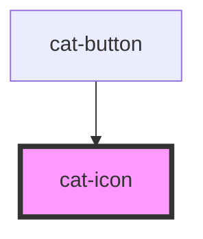

# cat-icon

<!-- Auto Generated Below -->

## Properties

| Property    | Attribute      | Description                                                                                                                                  | Type                                            | Default     |
| ----------- | -------------- | -------------------------------------------------------------------------------------------------------------------------------------------- | ----------------------------------------------- | ----------- |
| `a11yLabel` | `a-1-1y-label` | Adds accessible label for the spinner that is only shown for screen readers. The `aria-hidden` attribute will be set if no label is present. | `string \| undefined`                           | `undefined` |
| `name`      | `name`         | The name of the icon.                                                                                                                        | `string`                                        | `''`        |
| `size`      | `size`         | The size of the icon.                                                                                                                        | `"inline" \| "l" \| "m" \| "s" \| "xl" \| "xs"` | `'m'`       |

## Dependencies

### Used by

- [cat-button](../cat-button)

### Graph

---

_Built with [StencilJS](https://stenciljs.com/)_
